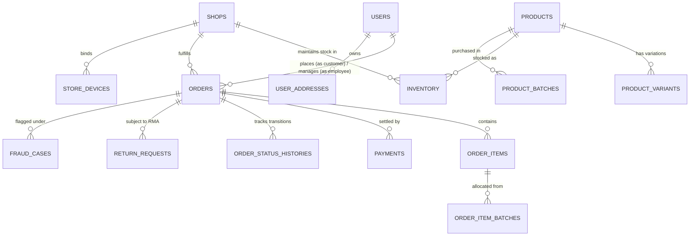

# HajjMart Enterprise Database Schema Reference

> **Agentic AI Context & Specification Document**  
> **Application**: HajjMart Multi-Channel Retail & E-Commerce Platform  
> **Architecture**: Laravel 11 Backend + MySQL / SQLite Database Engine  
> **Schema Scope**: 73 Production Tables (Fully Mapped)  
> **Generated For**: Autonomous Agentic Coding, Database Queries, Migrations & Domain Logic

---

## Table of Contents

- [1. Authentication, Users & Identity](#1-authentication-users-identity) (5 tables)
  - [`users`](#users)
  - [`user_addresses`](#user_addresses)
  - [`personal_access_tokens`](#personal_access_tokens)
  - [`password_reset_tokens`](#password_reset_tokens)
  - [`sessions`](#sessions)
- [2. Stores, Outlets & Physical Infrastructure](#2-stores-outlets-physical-infrastructure) (3 tables)
  - [`shops`](#shops)
  - [`store_devices`](#store_devices)
  - [`delivery_charges`](#delivery_charges)
- [3. Product Catalog, Variations & Taxonomy](#3-product-catalog-variations-taxonomy) (13 tables)
  - [`products`](#products)
  - [`product_variants`](#product_variants)
  - [`product_attributes`](#product_attributes)
  - [`product_attribute_values`](#product_attribute_values)
  - [`product_variant_attribute_values`](#product_variant_attribute_values)
  - [`variations`](#variations)
  - [`categories`](#categories)
  - [`category_product`](#category_product)
  - [`category_images`](#category_images)
  - [`product_images`](#product_images)
  - [`product_tags`](#product_tags)
  - [`product_tag_pivot`](#product_tag_pivot)
  - [`imagekit_file_ids`](#imagekit_file_ids)
- [4. Multi-Store Inventory, Batches & Movements](#4-multi-store-inventory-batches-movements) (6 tables)
  - [`inventory`](#inventory)
  - [`product_batches`](#product_batches)
  - [`reserved_products`](#reserved_products)
  - [`stock_movements`](#stock_movements)
  - [`stock_transfers`](#stock_transfers)
  - [`stock_transfer_items`](#stock_transfer_items)
- [5. Orders, Line Items & Workflow History](#5-orders-line-items-workflow-history) (8 tables)
  - [`orders`](#orders)
  - [`order_items`](#order_items)
  - [`order_item_batches`](#order_item_batches)
  - [`order_lists`](#order_lists)
  - [`order_status_histories`](#order_status_histories)
  - [`order_item_status_histories`](#order_item_status_histories)
  - [`customer_cart_items`](#customer_cart_items)
  - [`wishlists`](#wishlists)
- [6. Payments, Billing & Gateways](#6-payments-billing-gateways) (3 tables)
  - [`payments`](#payments)
  - [`payment_cod_details`](#payment_cod_details)
  - [`stripe_ids`](#stripe_ids)
- [7. Returns, Exchanges & Cancellations](#7-returns-exchanges-cancellations) (4 tables)
  - [`return_requests`](#return_requests)
  - [`return_request_items`](#return_request_items)
  - [`return_status_histories`](#return_status_histories)
  - [`cancellation_requests`](#cancellation_requests)
- [8. Promotions, Coupons & Discounts](#8-promotions-coupons-discounts) (3 tables)
  - [`coupons`](#coupons)
  - [`coupon_usages`](#coupon_usages)
  - [`coupon_applications`](#coupon_applications)
- [9. Fraud Prevention, Risk Scoring & ECM](#9-fraud-prevention-risk-scoring-ecm) (4 tables)
  - [`fraud_cases`](#fraud_cases)
  - [`fraud_case_notes`](#fraud_case_notes)
  - [`risk_events`](#risk_events)
  - [`risk_rules`](#risk_rules)
- [10. Offline POS, Multi-Device Sync & Reconciliation](#10-offline-pos-multi-device-sync-reconciliation) (5 tables)
  - [`offline_inventory_sessions`](#offline_inventory_sessions)
  - [`offline_inventory_snapshot_items`](#offline_inventory_snapshot_items)
  - [`offline_event_receipts`](#offline_event_receipts)
  - [`offline_reconciliation_actions`](#offline_reconciliation_actions)
  - [`offline_recovery_cases`](#offline_recovery_cases)
- [11. Customer Feedback, Q&A & Inquiries](#11-customer-feedback-q-a-inquiries) (6 tables)
  - [`product_reviews`](#product_reviews)
  - [`review_images`](#review_images)
  - [`product_questions`](#product_questions)
  - [`product_answers`](#product_answers)
  - [`social_shares`](#social_shares)
  - [`contact_messages`](#contact_messages)
- [12. Analytics, CMS, Audit & System Infrastructure](#12-analytics-cms-audit-system-infrastructure) (13 tables)
  - [`daily_sales_summaries`](#daily_sales_summaries)
  - [`homepage_sections`](#homepage_sections)
  - [`site_settings`](#site_settings)
  - [`activity_logs`](#activity_logs)
  - [`notifications`](#notifications)
  - [`cache`](#cache)
  - [`cache_locks`](#cache_locks)
  - [`jobs`](#jobs)
  - [`job_batches`](#job_batches)
  - [`failed_jobs`](#failed_jobs)
  - [`telescope_entries`](#telescope_entries)
  - [`telescope_entries_tags`](#telescope_entries_tags)
  - [`telescope_monitoring`](#telescope_monitoring)
- [Key Enums, Channels & State Machines](#key-enums-channels--state-machines)
- [Core Entity Relationship Overview](#core-entity-relationship-overview)

---

## Key Enums, Channels & State Machines

### 1. Order Status Lifecycle (`orders.status` & `orders.order_status`)
- `pending`: Order placed, waiting for payment (online) or flagged for fraud screening / verification.
- `confirmed`: Order verified by system or admin, inventory actively reserved, ready for packing.
- `processing` / `ready_to_ship`: Items packed by warehouse staff (`packed_by` set).
- `shipped`: Handed over to logistics/courier (Pathao consignment assigned). Stock committed from inventory.
- `delivered`: Successfully delivered to recipient. Dues cleared.
- `returned`: Customer refused delivery or full RMA return completed. Stock returned to inventory.
- `cancelled`: Order cancelled before shipment. Stock reservation released immediately.

### 2. Payment Status (`orders.payment_status` & `payments.status`)
- `due`: Unpaid balance remaining (Standard for COD before delivery).
- `partially_paid`: Partial advance paid (e.g. delivery fee paid in advance).
- `paid`: Fully settled.
- `refunded`: Returned or reversed.

### 3. Sales Source Channels (`orders.source_channel`)
- `website` / `ecommerce`: Online self-serve storefront checkout.
- `social_commerce`: Social chat / phone orders entered by agents.
- `pos`: Physical retail point-of-sale store counter sales.

### 4. Reconciliation Status (`orders.reconciliation_status`)
- `normal`: Standard online / synchronized order.
- `provisional`: Offline POS sale waiting for store sync reconciliation.
- `reconciled`: Offline sale reconciled with central warehouse stock.
- `conflict`: Out-of-stock anomaly flagged for manual recovery.

---

## Core Entity Relationship Overview

---

## 1. Authentication, Users & Identity

### `users`

**Purpose**: Primary user accounts spanning customers, employees, managers, and super administrators.

| Column Name | Type | Nullable | Default | Constraints / Index |
| :--- | :--- | :---: | :--- | :--- |
| `id` | `bigint unsigned` | **NO** | — | **AUTO_INCREMENT** **PRIMARY KEY** |
| `name` | `varchar(255)` | **NO** | — | — |
| `name_bn` | `varchar(255)` | YES | — | — |
| `email` | `varchar(255)` | YES | — | `UNIQUE (users_email_unique)` |
| `email_verified_at` | `timestamp` | YES | — | — |
| `password` | `varchar(255)` | **NO** | — | — |
| `remember_token` | `varchar(100)` | YES | — | — |
| `created_at` | `timestamp` | YES | — | — |
| `updated_at` | `timestamp` | YES | — | — |
| `phone` | `varchar(255)` | YES | — | — |
| `avatar` | `varchar(255)` | YES | — | — |
| `address_default_id` | `bigint unsigned` | YES | — | — |
| `is_active` | `tinyint(1)` | **NO** | `1` | — |
| `deleted_at` | `timestamp` | YES | — | — |
| `employee_code` | `varchar(255)` | YES | — | `UNIQUE (users_employee_code_unique)` |
| `designation` | `varchar(255)` | YES | — | — |
| `shop_id` | `bigint unsigned` | YES | — | `INDEX (users_shop_id_foreign)` `FK -> shops.id` |
| `joined_at` | `date` | YES | — | — |
| `last_login_at` | `timestamp` | YES | — | — |
| `created_by` | `bigint unsigned` | YES | — | `INDEX (users_created_by_foreign)` `FK -> users.id` |
| `notes` | `text` | YES | — | — |
| `is_employee` | `tinyint(1)` | **NO** | `0` | `INDEX (users_is_employee_index)` |
| `is_admin` | `tinyint(1)` | **NO** | `0` | `INDEX (users_is_admin_index)` |

**Foreign Key Constraints**:
- `users_created_by_foreign`: (`created_by`) $\rightarrow$ `users`(`id`) ON DELETE SET NULL ON UPDATE NO ACTION
- `users_shop_id_foreign`: (`shop_id`) $\rightarrow$ `shops`(`id`) ON DELETE SET NULL ON UPDATE NO ACTION

**Indexes**:
- `primary` (PRIMARY): `(id)`
- `users_created_by_foreign` (INDEX): `(created_by)`
- `users_email_unique` (UNIQUE): `(email)`
- `users_employee_code_unique` (UNIQUE): `(employee_code)`
- `users_is_admin_index` (INDEX): `(is_admin)`
- `users_is_employee_index` (INDEX): `(is_employee)`
- `users_shop_id_foreign` (INDEX): `(shop_id)`

---

### `user_addresses`

**Purpose**: Customer delivery and billing address book with default shipping address flags.

| Column Name | Type | Nullable | Default | Constraints / Index |
| :--- | :--- | :---: | :--- | :--- |
| `id` | `bigint unsigned` | **NO** | — | **AUTO_INCREMENT** **PRIMARY KEY** |
| `user_id` | `bigint unsigned` | **NO** | — | `INDEX (user_addresses_user_id_foreign)` `FK -> users.id` |
| `label` | `varchar(255)` | YES | — | — |
| `recipient_name` | `varchar(255)` | **NO** | — | — |
| `phone` | `varchar(255)` | **NO** | — | — |
| `mobile_number` | `varchar(255)` | YES | — | — |
| `email` | `varchar(255)` | YES | — | — |
| `country` | `varchar(255)` | **NO** | `Bangladesh` | — |
| `full_address` | `text` | YES | — | — |
| `address_line_1` | `varchar(255)` | **NO** | — | — |
| `address_line_2` | `varchar(255)` | YES | — | — |
| `city` | `varchar(255)` | YES | — | — |
| `district` | `varchar(255)` | YES | — | — |
| `upazila` | `varchar(255)` | YES | — | — |
| `area` | `varchar(255)` | YES | — | — |
| `landmark` | `varchar(255)` | YES | — | — |
| `division` | `varchar(255)` | YES | — | — |
| `postal_code` | `varchar(255)` | YES | — | — |
| `is_default` | `tinyint(1)` | **NO** | `0` | — |
| `created_at` | `timestamp` | YES | — | — |
| `updated_at` | `timestamp` | YES | — | — |

**Foreign Key Constraints**:
- `user_addresses_user_id_foreign`: (`user_id`) $\rightarrow$ `users`(`id`) ON DELETE CASCADE ON UPDATE NO ACTION

**Indexes**:
- `primary` (PRIMARY): `(id)`
- `user_addresses_user_id_foreign` (INDEX): `(user_id)`

---

### `personal_access_tokens`

**Purpose**: Laravel Sanctum API tokens for mobile, POS, and frontend client authentication.

| Column Name | Type | Nullable | Default | Constraints / Index |
| :--- | :--- | :---: | :--- | :--- |
| `id` | `bigint unsigned` | **NO** | — | **AUTO_INCREMENT** **PRIMARY KEY** |
| `tokenable_type` | `varchar(255)` | **NO** | — | `INDEX (personal_access_tokens_tokenable_type_tokenable_id_index)` |
| `tokenable_id` | `bigint unsigned` | **NO** | — | `INDEX (personal_access_tokens_tokenable_type_tokenable_id_index)` |
| `name` | `text` | **NO** | — | — |
| `token` | `varchar(64)` | **NO** | — | `UNIQUE (personal_access_tokens_token_unique)` |
| `abilities` | `text` | YES | — | — |
| `last_used_at` | `timestamp` | YES | — | — |
| `expires_at` | `timestamp` | YES | — | `INDEX (personal_access_tokens_expires_at_index)` |
| `created_at` | `timestamp` | YES | — | — |
| `updated_at` | `timestamp` | YES | — | — |

**Indexes**:
- `personal_access_tokens_expires_at_index` (INDEX): `(expires_at)`
- `personal_access_tokens_token_unique` (UNIQUE): `(token)`
- `personal_access_tokens_tokenable_type_tokenable_id_index` (INDEX): `(tokenable_type, tokenable_id)`
- `primary` (PRIMARY): `(id)`

---

### `password_reset_tokens`

**Purpose**: Secure token hashes for customer and employee password recovery workflows.

| Column Name | Type | Nullable | Default | Constraints / Index |
| :--- | :--- | :---: | :--- | :--- |
| `email` | `varchar(255)` | **NO** | — | **PRIMARY KEY** |
| `token` | `varchar(255)` | **NO** | — | — |
| `created_at` | `timestamp` | YES | — | — |

**Indexes**:
- `primary` (PRIMARY): `(email)`

---

### `sessions`

**Purpose**: HTTP web session state storage for storefront and admin users.

| Column Name | Type | Nullable | Default | Constraints / Index |
| :--- | :--- | :---: | :--- | :--- |
| `id` | `varchar(255)` | **NO** | — | **PRIMARY KEY** |
| `user_id` | `bigint unsigned` | YES | — | `INDEX (sessions_user_id_index)` |
| `ip_address` | `varchar(45)` | YES | — | — |
| `user_agent` | `text` | YES | — | — |
| `payload` | `longtext` | **NO** | — | — |
| `last_activity` | `int` | **NO** | — | `INDEX (sessions_last_activity_index)` |

**Indexes**:
- `primary` (PRIMARY): `(id)`
- `sessions_last_activity_index` (INDEX): `(last_activity)`
- `sessions_user_id_index` (INDEX): `(user_id)`

---

## 2. Stores, Outlets & Physical Infrastructure

### `shops`

**Purpose**: Physical store locations, retail outlets, fulfillment hubs, and warehouses.

| Column Name | Type | Nullable | Default | Constraints / Index |
| :--- | :--- | :---: | :--- | :--- |
| `id` | `bigint unsigned` | **NO** | — | **AUTO_INCREMENT** **PRIMARY KEY** |
| `created_at` | `timestamp` | YES | — | — |
| `updated_at` | `timestamp` | YES | — | — |
| `name` | `varchar(255)` | **NO** | `HajjMart Main Store` | — |
| `code` | `varchar(255)` | YES | — | `UNIQUE (shops_code_unique)` |
| `slug` | `varchar(255)` | YES | — | `UNIQUE (shops_slug_unique)` |
| `address` | `text` | YES | — | — |
| `phone` | `varchar(255)` | YES | — | — |
| `email` | `varchar(255)` | YES | — | — |
| `manager_id` | `bigint unsigned` | YES | — | `INDEX (shops_manager_id_foreign)` `FK -> users.id` |
| `is_active` | `tinyint(1)` | **NO** | `1` | `INDEX (shops_is_active_index)` |
| `is_default` | `tinyint(1)` | **NO** | `0` | `INDEX (shops_is_default_index)` |
| `settings` | `json` | YES | — | — |
| `inventory_revision` | `bigint unsigned` | **NO** | `1` | — |

**Foreign Key Constraints**:
- `shops_manager_id_foreign`: (`manager_id`) $\rightarrow$ `users`(`id`) ON DELETE SET NULL ON UPDATE NO ACTION

**Indexes**:
- `primary` (PRIMARY): `(id)`
- `shops_code_unique` (UNIQUE): `(code)`
- `shops_is_active_index` (INDEX): `(is_active)`
- `shops_is_default_index` (INDEX): `(is_default)`
- `shops_manager_id_foreign` (INDEX): `(manager_id)`
- `shops_slug_unique` (UNIQUE): `(slug)`

---

### `store_devices`

**Purpose**: Registered POS and mobile devices assigned to specific stores with security tokens.

| Column Name | Type | Nullable | Default | Constraints / Index |
| :--- | :--- | :---: | :--- | :--- |
| `id` | `bigint unsigned` | **NO** | — | **AUTO_INCREMENT** **PRIMARY KEY** |
| `shop_id` | `bigint unsigned` | **NO** | — | `UNIQUE (store_devices_shop_id_unique)` `FK -> shops.id` |
| `device_uuid` | `char(36)` | **NO** | — | `UNIQUE (store_devices_device_uuid_unique)` |
| `device_token_hash` | `varchar(64)` | **NO** | — | — |
| `binding_version` | `int unsigned` | **NO** | `1` | — |
| `status` | `varchar(255)` | **NO** | `active` | `INDEX (store_devices_status_index)` |
| `operational_state` | `varchar(255)` | **NO** | `normal` | `INDEX (store_devices_operational_state_index)` |
| `registered_by` | `bigint unsigned` | YES | — | `INDEX (store_devices_registered_by_foreign)` `FK -> users.id` |
| `registered_at` | `timestamp` | YES | — | — |
| `last_heartbeat_at` | `timestamp` | YES | — | `INDEX (store_devices_last_heartbeat_at_index)` |
| `last_seen_user_id` | `bigint unsigned` | YES | — | `INDEX (store_devices_last_seen_user_id_foreign)` `FK -> users.id` |
| `last_app_version` | `varchar(255)` | YES | — | — |
| `replaced_at` | `timestamp` | YES | — | — |
| `replaced_by` | `bigint unsigned` | YES | — | `INDEX (store_devices_replaced_by_foreign)` `FK -> users.id` |
| `created_at` | `timestamp` | YES | — | — |
| `updated_at` | `timestamp` | YES | — | — |

**Foreign Key Constraints**:
- `store_devices_last_seen_user_id_foreign`: (`last_seen_user_id`) $\rightarrow$ `users`(`id`) ON DELETE SET NULL ON UPDATE NO ACTION
- `store_devices_registered_by_foreign`: (`registered_by`) $\rightarrow$ `users`(`id`) ON DELETE SET NULL ON UPDATE NO ACTION
- `store_devices_replaced_by_foreign`: (`replaced_by`) $\rightarrow$ `users`(`id`) ON DELETE SET NULL ON UPDATE NO ACTION
- `store_devices_shop_id_foreign`: (`shop_id`) $\rightarrow$ `shops`(`id`) ON DELETE CASCADE ON UPDATE NO ACTION

**Indexes**:
- `primary` (PRIMARY): `(id)`
- `store_devices_device_uuid_unique` (UNIQUE): `(device_uuid)`
- `store_devices_last_heartbeat_at_index` (INDEX): `(last_heartbeat_at)`
- `store_devices_last_seen_user_id_foreign` (INDEX): `(last_seen_user_id)`
- `store_devices_operational_state_index` (INDEX): `(operational_state)`
- `store_devices_registered_by_foreign` (INDEX): `(registered_by)`
- `store_devices_replaced_by_foreign` (INDEX): `(replaced_by)`
- `store_devices_shop_id_unique` (UNIQUE): `(shop_id)`
- `store_devices_status_index` (INDEX): `(status)`

---

### `delivery_charges`

**Purpose**: District and zone based shipping rates and delivery fees.

| Column Name | Type | Nullable | Default | Constraints / Index |
| :--- | :--- | :---: | :--- | :--- |
| `id` | `bigint unsigned` | **NO** | — | **AUTO_INCREMENT** **PRIMARY KEY** |
| `division` | `varchar(255)` | YES | — | `UNIQUE (delivery_charges_division_district_unique)` |
| `district` | `varchar(255)` | YES | — | `UNIQUE (delivery_charges_division_district_unique)` |
| `charge` | `decimal(8,2)` | **NO** | `0.00` | — |
| `created_at` | `timestamp` | YES | — | — |
| `updated_at` | `timestamp` | YES | — | — |

**Indexes**:
- `delivery_charges_division_district_unique` (UNIQUE): `(division, district)`
- `primary` (PRIMARY): `(id)`

---

## 3. Product Catalog, Variations & Taxonomy

### `products`

**Purpose**: Master product catalog items with pricing, SKUs, barcode mappings, and dimensions.

| Column Name | Type | Nullable | Default | Constraints / Index |
| :--- | :--- | :---: | :--- | :--- |
| `id` | `bigint unsigned` | **NO** | — | **AUTO_INCREMENT** **PRIMARY KEY** |
| `name` | `varchar(255)` | **NO** | — | — |
| `has_variations` | `tinyint(1)` | **NO** | `0` | — |
| `selling_price` | `decimal(15,2)` | YES | — | — |
| `retail_price` | `decimal(15,2)` | YES | — | — |
| `wholesale_price` | `decimal(15,2)` | YES | — | — |
| `has_dynamic_pricing` | `tinyint(1)` | **NO** | `0` | — |
| `price_slabs` | `json` | YES | — | — |
| `sold_count` | `bigint unsigned` | **NO** | `0` | — |
| `total_count` | `bigint unsigned` | **NO** | `0` | — |
| `image_src` | `json` | YES | — | — |
| `description` | `text` | YES | — | — |
| `created_at` | `timestamp` | YES | — | — |
| `updated_at` | `timestamp` | YES | — | — |
| `category_id` | `bigint unsigned` | YES | — | `INDEX (products_category_id_foreign)` `FK -> categories.id` |
| `source_product_id` | `bigint unsigned` | YES | — | `UNIQUE (products_source_product_id_unique)` |
| `source_url` | `text` | YES | — | — |
| `slug` | `varchar(255)` | YES | — | `UNIQUE (products_slug_unique)` |
| `sku` | `varchar(255)` | YES | — | `INDEX (products_sku_index)` |
| `barcode` | `varchar(255)` | YES | — | `INDEX (products_barcode_index)` |
| `product_type` | `varchar(255)` | **NO** | `simple` | — |
| `product_type_source` | `varchar(255)` | YES | — | — |
| `sku_source` | `varchar(255)` | YES | — | — |
| `product_id_source` | `varchar(255)` | YES | — | — |
| `default_variation_sku` | `varchar(255)` | YES | — | — |
| `currency` | `varchar(8)` | **NO** | `BDT` | — |
| `price_text` | `text` | YES | — | — |
| `regular_price` | `decimal(12,2)` | YES | — | — |
| `base_price` | `decimal(12,2)` | YES | — | — |
| `sale_price` | `decimal(12,2)` | YES | — | — |
| `cost_price` | `decimal(12,2)` | YES | — | — |
| `price_min` | `decimal(12,2)` | YES | — | — |
| `price_max` | `decimal(12,2)` | YES | — | — |
| `regular_price_min` | `decimal(12,2)` | YES | — | — |
| `regular_price_max` | `decimal(12,2)` | YES | — | — |
| `tax_rate` | `decimal(5,2)` | **NO** | `0.00` | — |
| `tax_inclusive` | `tinyint(1)` | **NO** | `1` | — |
| `stock_status` | `varchar(255)` | YES | — | `INDEX (products_stock_status_index)` |
| `stock_text` | `varchar(255)` | YES | — | — |
| `purchasable` | `tinyint(1)` | **NO** | `1` | — |
| `short_description` | `text` | YES | — | — |
| `summary_description` | `text` | YES | — | — |
| `long_description` | `longtext` | YES | — | — |
| `short_description_html` | `longtext` | YES | — | — |
| `summary_description_html` | `longtext` | YES | — | — |
| `description_html` | `longtext` | YES | — | — |
| `long_description_html` | `longtext` | YES | — | — |
| `short_description_clean_html` | `longtext` | YES | — | — |
| `description_clean_html` | `longtext` | YES | — | — |
| `long_description_clean_html` | `longtext` | YES | — | — |
| `additional_information` | `json` | YES | — | — |
| `additional_information_rows` | `json` | YES | — | — |
| `additional_information_text` | `text` | YES | — | — |
| `additional_information_html` | `longtext` | YES | — | — |
| `additional_information_clean_html` | `longtext` | YES | — | — |
| `specifications` | `json` | YES | — | — |
| `variation_attribute_options` | `json` | YES | — | — |
| `variation_extraction` | `varchar(255)` | YES | — | — |
| `variation_warning` | `text` | YES | — | — |
| `stock_summary` | `json` | YES | — | — |
| `brand` | `varchar(255)` | YES | — | — |
| `brands` | `json` | YES | — | — |
| `discovery_sources` | `json` | YES | — | — |
| `visible_in_shop` | `tinyint(1)` | **NO** | `1` | — |
| `sell_on_website` | `tinyint(1)` | **NO** | `1` | — |
| `sell_on_social` | `tinyint(1)` | **NO** | `1` | — |
| `sell_on_pos` | `tinyint(1)` | **NO** | `1` | — |
| `raw_payload` | `json` | YES | — | — |
| `scraped_at` | `timestamp` | YES | — | — |
| `weight` | `decimal(10,3)` | YES | — | — |
| `weight_unit` | `varchar(255)` | **NO** | `kg` | — |
| `dimensions_json` | `json` | YES | — | — |
| `is_featured` | `tinyint(1)` | **NO** | `0` | — |
| `is_active` | `tinyint(1)` | **NO** | `1` | — |
| `is_digital` | `tinyint(1)` | **NO** | `0` | — |
| `meta_title` | `varchar(255)` | YES | — | — |
| `meta_description` | `text` | YES | — | — |
| `meta_keywords` | `text` | YES | — | — |
| `deleted_at` | `timestamp` | YES | — | — |
| `average_rating` | `decimal(3,2)` | **NO** | `0.00` | — |
| `review_count` | `int` | **NO** | `0` | — |

**Foreign Key Constraints**:
- `products_category_id_foreign`: (`category_id`) $\rightarrow$ `categories`(`id`) ON DELETE SET NULL ON UPDATE NO ACTION

**Indexes**:
- `primary` (PRIMARY): `(id)`
- `products_barcode_index` (INDEX): `(barcode)`
- `products_category_id_foreign` (INDEX): `(category_id)`
- `products_sku_index` (INDEX): `(sku)`
- `products_slug_unique` (UNIQUE): `(slug)`
- `products_source_product_id_unique` (UNIQUE): `(source_product_id)`
- `products_stock_status_index` (INDEX): `(stock_status)`

---

### `product_variants`

**Purpose**: SKU-level product variants representing specific attribute combinations (e.g. Size/Color).

| Column Name | Type | Nullable | Default | Constraints / Index |
| :--- | :--- | :---: | :--- | :--- |
| `id` | `bigint unsigned` | **NO** | — | **AUTO_INCREMENT** **PRIMARY KEY** |
| `product_id` | `bigint unsigned` | **NO** | — | `INDEX (product_variants_product_id_foreign)` `FK -> products.id` |
| `source_variation_id` | `bigint unsigned` | YES | — | `INDEX (product_variants_source_variation_id_index)` |
| `sku` | `varchar(255)` | YES | — | `INDEX (product_variants_sku_index)` |
| `barcode` | `varchar(255)` | YES | — | `INDEX (product_variants_barcode_index)` |
| `price` | `decimal(12,2)` | YES | — | — |
| `sale_price` | `decimal(12,2)` | YES | — | — |
| `retail_price` | `decimal(12,2)` | YES | — | — |
| `wholesale_price` | `decimal(12,2)` | YES | — | — |
| `regular_price` | `decimal(12,2)` | YES | — | — |
| `cost_price` | `decimal(12,2)` | YES | — | — |
| `image_id` | `bigint unsigned` | YES | — | `INDEX (product_variants_image_id_foreign)` `FK -> product_images.id` |
| `attributes_json` | `json` | YES | — | — |
| `attribute_labels` | `json` | YES | — | — |
| `attribute_values` | `json` | YES | — | — |
| `variation_description` | `text` | YES | — | — |
| `weight` | `varchar(255)` | YES | — | — |
| `dimensions_json` | `json` | YES | — | — |
| `in_stock` | `tinyint(1)` | **NO** | `1` | — |
| `purchasable` | `tinyint(1)` | **NO** | `1` | — |
| `available_for_purchase` | `tinyint(1)` | **NO** | `1` | — |
| `image_json` | `json` | YES | — | — |
| `is_active` | `tinyint(1)` | **NO** | `1` | — |
| `created_at` | `timestamp` | YES | — | — |
| `updated_at` | `timestamp` | YES | — | — |

**Foreign Key Constraints**:
- `product_variants_image_id_foreign`: (`image_id`) $\rightarrow$ `product_images`(`id`) ON DELETE SET NULL ON UPDATE NO ACTION
- `product_variants_product_id_foreign`: (`product_id`) $\rightarrow$ `products`(`id`) ON DELETE CASCADE ON UPDATE NO ACTION

**Indexes**:
- `primary` (PRIMARY): `(id)`
- `product_variants_barcode_index` (INDEX): `(barcode)`
- `product_variants_image_id_foreign` (INDEX): `(image_id)`
- `product_variants_product_id_foreign` (INDEX): `(product_id)`
- `product_variants_sku_index` (INDEX): `(sku)`
- `product_variants_source_variation_id_index` (INDEX): `(source_variation_id)`

---

### `product_attributes`

**Purpose**: Global attribute definitions (e.g. 'Size', 'Color', 'Material', 'Fabric').

| Column Name | Type | Nullable | Default | Constraints / Index |
| :--- | :--- | :---: | :--- | :--- |
| `id` | `bigint unsigned` | **NO** | — | **AUTO_INCREMENT** **PRIMARY KEY** |
| `name` | `varchar(255)` | **NO** | — | `UNIQUE (product_attributes_name_unique)` |
| `created_at` | `timestamp` | YES | — | — |
| `updated_at` | `timestamp` | YES | — | — |

**Indexes**:
- `primary` (PRIMARY): `(id)`
- `product_attributes_name_unique` (UNIQUE): `(name)`

---

### `product_attribute_values`

**Purpose**: Allowed option values for global attributes (e.g. 'XL', 'Black', 'Cotton').

| Column Name | Type | Nullable | Default | Constraints / Index |
| :--- | :--- | :---: | :--- | :--- |
| `id` | `bigint unsigned` | **NO** | — | **AUTO_INCREMENT** **PRIMARY KEY** |
| `attribute_id` | `bigint unsigned` | **NO** | — | `UNIQUE (product_attribute_values_attribute_id_value_unique)` `FK -> product_attributes.id` |
| `value` | `varchar(255)` | **NO** | — | `UNIQUE (product_attribute_values_attribute_id_value_unique)` |
| `created_at` | `timestamp` | YES | — | — |
| `updated_at` | `timestamp` | YES | — | — |

**Foreign Key Constraints**:
- `product_attribute_values_attribute_id_foreign`: (`attribute_id`) $\rightarrow$ `product_attributes`(`id`) ON DELETE CASCADE ON UPDATE NO ACTION

**Indexes**:
- `primary` (PRIMARY): `(id)`
- `product_attribute_values_attribute_id_value_unique` (UNIQUE): `(attribute_id, value)`

---

### `product_variant_attribute_values`

**Purpose**: Pivot linking specific product variants to their constituent attribute values.

| Column Name | Type | Nullable | Default | Constraints / Index |
| :--- | :--- | :---: | :--- | :--- |
| `variant_id` | `bigint unsigned` | **NO** | — | **PRIMARY KEY** `FK -> product_variants.id` |
| `attribute_value_id` | `bigint unsigned` | **NO** | — | **PRIMARY KEY** `INDEX (product_variant_attribute_values_attribute_value_id_foreign)` `FK -> product_attribute_values.id` |

**Foreign Key Constraints**:
- `product_variant_attribute_values_attribute_value_id_foreign`: (`attribute_value_id`) $\rightarrow$ `product_attribute_values`(`id`) ON DELETE CASCADE ON UPDATE NO ACTION
- `product_variant_attribute_values_variant_id_foreign`: (`variant_id`) $\rightarrow$ `product_variants`(`id`) ON DELETE CASCADE ON UPDATE NO ACTION

**Indexes**:
- `primary` (PRIMARY): `(variant_id, attribute_value_id)`
- `product_variant_attribute_values_attribute_value_id_foreign` (INDEX): `(attribute_value_id)`

---

### `variations`

**Purpose**: Legacy variation definitions maintained for backward compatibility.

| Column Name | Type | Nullable | Default | Constraints / Index |
| :--- | :--- | :---: | :--- | :--- |
| `id` | `bigint unsigned` | **NO** | — | **AUTO_INCREMENT** **PRIMARY KEY** |
| `product_id` | `bigint unsigned` | **NO** | — | `INDEX (variations_product_id_foreign)` `FK -> products.id` |
| `name` | `varchar(255)` | **NO** | — | — |
| `selling_price` | `decimal(10,2)` | YES | — | — |
| `has_dynamic_pricing` | `tinyint(1)` | **NO** | `0` | — |
| `price_slabs` | `json` | YES | — | — |
| `image_src` | `json` | YES | — | — |
| `created_at` | `timestamp` | YES | — | — |
| `updated_at` | `timestamp` | YES | — | — |

**Foreign Key Constraints**:
- `variations_product_id_foreign`: (`product_id`) $\rightarrow$ `products`(`id`) ON DELETE CASCADE ON UPDATE NO ACTION

**Indexes**:
- `primary` (PRIMARY): `(id)`
- `variations_product_id_foreign` (INDEX): `(product_id)`

---

### `categories`

**Purpose**: Hierarchical product taxonomy and categorization structure.

| Column Name | Type | Nullable | Default | Constraints / Index |
| :--- | :--- | :---: | :--- | :--- |
| `id` | `bigint unsigned` | **NO** | — | **AUTO_INCREMENT** **PRIMARY KEY** |
| `name` | `varchar(255)` | **NO** | `` | `UNIQUE (categories_name_unique)` |
| `created_at` | `timestamp` | YES | — | — |
| `updated_at` | `timestamp` | YES | — | — |
| `parent_id` | `bigint unsigned` | YES | — | `INDEX (categories_parent_id_foreign)` `FK -> categories.id` |
| `slug` | `varchar(255)` | YES | — | `UNIQUE (categories_slug_unique)` |
| `description` | `text` | YES | — | — |
| `image` | `varchar(255)` | YES | — | — |
| `icon` | `varchar(255)` | YES | — | — |
| `sort_order` | `int` | **NO** | `0` | — |
| `is_active` | `tinyint(1)` | **NO** | `1` | — |
| `deleted_at` | `timestamp` | YES | — | — |

**Foreign Key Constraints**:
- `categories_parent_id_foreign`: (`parent_id`) $\rightarrow$ `categories`(`id`) ON DELETE SET NULL ON UPDATE NO ACTION

**Indexes**:
- `categories_name_unique` (UNIQUE): `(name)`
- `categories_parent_id_foreign` (INDEX): `(parent_id)`
- `categories_slug_unique` (UNIQUE): `(slug)`
- `primary` (PRIMARY): `(id)`

---

### `category_product`

**Purpose**: Many-to-many relationship mapping products into one or more categories.

| Column Name | Type | Nullable | Default | Constraints / Index |
| :--- | :--- | :---: | :--- | :--- |
| `product_id` | `bigint unsigned` | **NO** | — | **PRIMARY KEY** `FK -> products.id` |
| `category_id` | `bigint unsigned` | **NO** | — | `INDEX (category_product_category_id_foreign)` **PRIMARY KEY** `FK -> categories.id` |

**Foreign Key Constraints**:
- `category_product_category_id_foreign`: (`category_id`) $\rightarrow$ `categories`(`id`) ON DELETE CASCADE ON UPDATE NO ACTION
- `category_product_product_id_foreign`: (`product_id`) $\rightarrow$ `products`(`id`) ON DELETE CASCADE ON UPDATE NO ACTION

**Indexes**:
- `category_product_category_id_foreign` (INDEX): `(category_id)`
- `primary` (PRIMARY): `(product_id, category_id)`

---

### `category_images`

**Purpose**: Media assets and banners associated with catalog categories.

| Column Name | Type | Nullable | Default | Constraints / Index |
| :--- | :--- | :---: | :--- | :--- |
| `id` | `bigint unsigned` | **NO** | — | **AUTO_INCREMENT** **PRIMARY KEY** |
| `category_id` | `bigint unsigned` | **NO** | — | `INDEX (category_images_category_id_foreign)` `FK -> categories.id` |
| `image_url` | `varchar(255)` | **NO** | `` | — |
| `created_at` | `timestamp` | YES | — | — |
| `updated_at` | `timestamp` | YES | — | — |

**Foreign Key Constraints**:
- `category_images_category_id_foreign`: (`category_id`) $\rightarrow$ `categories`(`id`) ON DELETE CASCADE ON UPDATE NO ACTION

**Indexes**:
- `category_images_category_id_foreign` (INDEX): `(category_id)`
- `primary` (PRIMARY): `(id)`

---

### `product_images`

**Purpose**: Gallery images and thumbnails attached to products.

| Column Name | Type | Nullable | Default | Constraints / Index |
| :--- | :--- | :---: | :--- | :--- |
| `id` | `bigint unsigned` | **NO** | — | **AUTO_INCREMENT** **PRIMARY KEY** |
| `product_id` | `bigint unsigned` | **NO** | — | `INDEX (product_images_product_id_foreign)` `FK -> products.id` |
| `path` | `varchar(255)` | YES | — | — |
| `source_url` | `text` | YES | — | — |
| `downloaded_url` | `text` | YES | — | — |
| `alt_text` | `varchar(255)` | YES | — | — |
| `mime_type` | `varchar(255)` | YES | — | — |
| `size_bytes` | `bigint unsigned` | YES | — | — |
| `sha256` | `varchar(255)` | YES | — | `INDEX (product_images_sha256_index)` |
| `source_aliases` | `json` | YES | — | — |
| `sort_order` | `int` | **NO** | `0` | — |
| `is_primary` | `tinyint(1)` | **NO** | `0` | — |
| `created_at` | `timestamp` | YES | — | — |

**Foreign Key Constraints**:
- `product_images_product_id_foreign`: (`product_id`) $\rightarrow$ `products`(`id`) ON DELETE CASCADE ON UPDATE NO ACTION

**Indexes**:
- `primary` (PRIMARY): `(id)`
- `product_images_product_id_foreign` (INDEX): `(product_id)`
- `product_images_sha256_index` (INDEX): `(sha256)`

---

### `product_tags`

**Purpose**: Search keywords, merchandising tags, and marketing labels.

| Column Name | Type | Nullable | Default | Constraints / Index |
| :--- | :--- | :---: | :--- | :--- |
| `id` | `bigint unsigned` | **NO** | — | **AUTO_INCREMENT** **PRIMARY KEY** |
| `name` | `varchar(255)` | **NO** | — | `UNIQUE (product_tags_name_unique)` |
| `slug` | `varchar(255)` | **NO** | — | `UNIQUE (product_tags_slug_unique)` |
| `created_at` | `timestamp` | YES | — | — |
| `updated_at` | `timestamp` | YES | — | — |

**Indexes**:
- `primary` (PRIMARY): `(id)`
- `product_tags_name_unique` (UNIQUE): `(name)`
- `product_tags_slug_unique` (UNIQUE): `(slug)`

---

### `product_tag_pivot`

**Purpose**: Many-to-many association between products and product tags.

| Column Name | Type | Nullable | Default | Constraints / Index |
| :--- | :--- | :---: | :--- | :--- |
| `product_id` | `bigint unsigned` | **NO** | — | **PRIMARY KEY** `FK -> products.id` |
| `tag_id` | `bigint unsigned` | **NO** | — | **PRIMARY KEY** `INDEX (product_tag_pivot_tag_id_foreign)` `FK -> product_tags.id` |

**Foreign Key Constraints**:
- `product_tag_pivot_product_id_foreign`: (`product_id`) $\rightarrow$ `products`(`id`) ON DELETE CASCADE ON UPDATE NO ACTION
- `product_tag_pivot_tag_id_foreign`: (`tag_id`) $\rightarrow$ `product_tags`(`id`) ON DELETE CASCADE ON UPDATE NO ACTION

**Indexes**:
- `primary` (PRIMARY): `(product_id, tag_id)`
- `product_tag_pivot_tag_id_foreign` (INDEX): `(tag_id)`

---

### `imagekit_file_ids`

**Purpose**: CDN media upload tracking and third-party ImageKit asset identifiers.

| Column Name | Type | Nullable | Default | Constraints / Index |
| :--- | :--- | :---: | :--- | :--- |
| `id` | `bigint unsigned` | **NO** | — | **AUTO_INCREMENT** **PRIMARY KEY** |
| `url` | `varchar(255)` | **NO** | — | `UNIQUE (imagekit_file_ids_url_unique)` |
| `file_id` | `varchar(255)` | **NO** | — | — |
| `created_at` | `timestamp` | YES | — | — |
| `updated_at` | `timestamp` | YES | — | — |

**Indexes**:
- `imagekit_file_ids_url_unique` (UNIQUE): `(url)`
- `primary` (PRIMARY): `(id)`

---

## 4. Multi-Store Inventory, Batches & Movements

### `inventory`

**Purpose**: Store-level inventory balance tracking physical stock quantity and reserved stock.

| Column Name | Type | Nullable | Default | Constraints / Index |
| :--- | :--- | :---: | :--- | :--- |
| `id` | `bigint unsigned` | **NO** | — | **AUTO_INCREMENT** **PRIMARY KEY** |
| `product_id` | `bigint unsigned` | **NO** | — | `INDEX (inventory_product_id_lookup_index)` `INDEX (inventory_product_variant_lookup_index)` `UNIQUE (inventory_product_variant_shop_unique)` `FK -> products.id` |
| `variant_id` | `bigint unsigned` | YES | — | `INDEX (inventory_product_variant_lookup_index)` `UNIQUE (inventory_product_variant_shop_unique)` `INDEX (inventory_variant_id_lookup_index)` `FK -> product_variants.id` |
| `quantity` | `int` | **NO** | `0` | — |
| `reserved` | `int` | **NO** | `0` | — |
| `low_stock_threshold` | `int` | **NO** | `5` | — |
| `location_note` | `varchar(255)` | YES | — | — |
| `updated_at` | `timestamp` | YES | — | — |
| `shop_id` | `bigint unsigned` | YES | — | `UNIQUE (inventory_product_variant_shop_unique)` `INDEX (inventory_shop_id_lookup_index)` `FK -> shops.id` |
| `bin_location` | `varchar(255)` | YES | — | — |
| `last_counted_at` | `timestamp` | YES | — | — |

**Foreign Key Constraints**:
- `inventory_product_id_foreign`: (`product_id`) $\rightarrow$ `products`(`id`) ON DELETE CASCADE ON UPDATE NO ACTION
- `inventory_shop_id_foreign`: (`shop_id`) $\rightarrow$ `shops`(`id`) ON DELETE CASCADE ON UPDATE NO ACTION
- `inventory_variant_id_foreign`: (`variant_id`) $\rightarrow$ `product_variants`(`id`) ON DELETE CASCADE ON UPDATE NO ACTION

**Indexes**:
- `inventory_product_id_lookup_index` (INDEX): `(product_id)`
- `inventory_product_variant_lookup_index` (INDEX): `(product_id, variant_id)`
- `inventory_product_variant_shop_unique` (UNIQUE): `(product_id, variant_id, shop_id)`
- `inventory_shop_id_lookup_index` (INDEX): `(shop_id)`
- `inventory_variant_id_lookup_index` (INDEX): `(variant_id)`
- `primary` (PRIMARY): `(id)`

---

### `product_batches`

**Purpose**: Purchased inventory batches tracking unit cost, expiry dates, supplier, and landed cost.

| Column Name | Type | Nullable | Default | Constraints / Index |
| :--- | :--- | :---: | :--- | :--- |
| `id` | `bigint unsigned` | **NO** | — | **AUTO_INCREMENT** **PRIMARY KEY** |
| `batch_reference` | `varchar(255)` | YES | — | `INDEX (product_batches_batch_reference_index)` |
| `product_id` | `bigint unsigned` | **NO** | — | `INDEX (product_batches_product_id_foreign)` `FK -> products.id` |
| `variation_id` | `bigint unsigned` | YES | — | `INDEX (product_batches_variation_id_foreign)` `FK -> variations.id` |
| `variant_id` | `bigint unsigned` | YES | — | `INDEX (product_batches_variant_id_foreign)` `FK -> product_variants.id` |
| `shop_id` | `bigint unsigned` | YES | — | `INDEX (product_batches_shop_id_foreign)` `FK -> shops.id` |
| `count` | `bigint unsigned` | **NO** | `0` | — |
| `initial_quantity` | `bigint unsigned` | **NO** | `0` | — |
| `cost_price` | `decimal(15,4)` | **NO** | `0.0000` | — |
| `selling_price` | `decimal(15,2)` | **NO** | `0.00` | — |
| `retail_price` | `decimal(15,2)` | YES | — | — |
| `wholesale_price` | `decimal(15,2)` | YES | — | — |
| `created_by` | `bigint unsigned` | YES | — | `INDEX (product_batches_created_by_foreign)` `FK -> users.id` |
| `note` | `text` | YES | — | — |
| `received_at` | `timestamp` | YES | — | `INDEX (product_batches_received_at_index)` |
| `created_at` | `timestamp` | YES | — | — |
| `updated_at` | `timestamp` | YES | — | — |

**Foreign Key Constraints**:
- `product_batches_created_by_foreign`: (`created_by`) $\rightarrow$ `users`(`id`) ON DELETE SET NULL ON UPDATE NO ACTION
- `product_batches_product_id_foreign`: (`product_id`) $\rightarrow$ `products`(`id`) ON DELETE CASCADE ON UPDATE NO ACTION
- `product_batches_shop_id_foreign`: (`shop_id`) $\rightarrow$ `shops`(`id`) ON DELETE SET NULL ON UPDATE NO ACTION
- `product_batches_variant_id_foreign`: (`variant_id`) $\rightarrow$ `product_variants`(`id`) ON DELETE SET NULL ON UPDATE NO ACTION
- `product_batches_variation_id_foreign`: (`variation_id`) $\rightarrow$ `variations`(`id`) ON DELETE CASCADE ON UPDATE NO ACTION

**Indexes**:
- `primary` (PRIMARY): `(id)`
- `product_batches_batch_reference_index` (INDEX): `(batch_reference)`
- `product_batches_created_by_foreign` (INDEX): `(created_by)`
- `product_batches_product_id_foreign` (INDEX): `(product_id)`
- `product_batches_received_at_index` (INDEX): `(received_at)`
- `product_batches_shop_id_foreign` (INDEX): `(shop_id)`
- `product_batches_variant_id_foreign` (INDEX): `(variant_id)`
- `product_batches_variation_id_foreign` (INDEX): `(variation_id)`

---

### `reserved_products`

**Purpose**: Real-time stock reservation locks held during pending checkout and provisional sync.

| Column Name | Type | Nullable | Default | Constraints / Index |
| :--- | :--- | :---: | :--- | :--- |
| `id` | `bigint unsigned` | **NO** | — | **AUTO_INCREMENT** **PRIMARY KEY** |
| `order_id` | `bigint unsigned` | **NO** | — | `INDEX (reserved_products_order_id_foreign)` `FK -> orders.id` |
| `product_id` | `bigint unsigned` | **NO** | — | `INDEX (reserved_products_product_id_foreign)` `FK -> products.id` |
| `variation_id` | `bigint unsigned` | YES | — | `INDEX (reserved_products_variation_id_index)` |
| `variant_id` | `bigint unsigned` | YES | — | `INDEX (reserved_products_variant_id_foreign)` `FK -> product_variants.id` |
| `shop_id` | `bigint unsigned` | YES | — | `INDEX (reserved_products_shop_id_foreign)` `FK -> shops.id` |
| `qty` | `int` | **NO** | `0` | — |
| `price` | `decimal(15,2)` | **NO** | `0.00` | — |
| `total` | `decimal(15,2)` | **NO** | `0.00` | — |
| `created_at` | `timestamp` | YES | — | — |
| `updated_at` | `timestamp` | YES | — | — |
| `order_item_id` | `bigint unsigned` | YES | — | `UNIQUE (reserved_products_order_item_unique)` `FK -> order_items.id` |
| `status` | `varchar(255)` | **NO** | `active` | `INDEX (reserved_products_status_index)` |
| `reservation_class` | `varchar(255)` | **NO** | `protected` | `INDEX (reserved_products_reservation_class_index)` |
| `source_channel` | `varchar(255)` | YES | — | `INDEX (reserved_products_source_channel_index)` |
| `reserved_at` | `timestamp` | YES | — | — |
| `committed_at` | `timestamp` | YES | — | — |
| `released_at` | `timestamp` | YES | — | — |
| `release_reason` | `varchar(255)` | YES | — | — |
| `metadata` | `json` | YES | — | — |

**Foreign Key Constraints**:
- `reserved_products_order_id_foreign`: (`order_id`) $\rightarrow$ `orders`(`id`) ON DELETE CASCADE ON UPDATE NO ACTION
- `reserved_products_order_item_id_foreign`: (`order_item_id`) $\rightarrow$ `order_items`(`id`) ON DELETE SET NULL ON UPDATE NO ACTION
- `reserved_products_product_id_foreign`: (`product_id`) $\rightarrow$ `products`(`id`) ON DELETE CASCADE ON UPDATE NO ACTION
- `reserved_products_shop_id_foreign`: (`shop_id`) $\rightarrow$ `shops`(`id`) ON DELETE SET NULL ON UPDATE NO ACTION
- `reserved_products_variant_id_foreign`: (`variant_id`) $\rightarrow$ `product_variants`(`id`) ON DELETE SET NULL ON UPDATE NO ACTION

**Indexes**:
- `primary` (PRIMARY): `(id)`
- `reserved_products_order_id_foreign` (INDEX): `(order_id)`
- `reserved_products_order_item_unique` (UNIQUE): `(order_item_id)`
- `reserved_products_product_id_foreign` (INDEX): `(product_id)`
- `reserved_products_reservation_class_index` (INDEX): `(reservation_class)`
- `reserved_products_shop_id_foreign` (INDEX): `(shop_id)`
- `reserved_products_source_channel_index` (INDEX): `(source_channel)`
- `reserved_products_status_index` (INDEX): `(status)`
- `reserved_products_variant_id_foreign` (INDEX): `(variant_id)`
- `reserved_products_variation_id_index` (INDEX): `(variation_id)`

---

### `stock_movements`

**Purpose**: Immutable audit trail of all inventory quantity adjustments, sales, transfers, and returns.

| Column Name | Type | Nullable | Default | Constraints / Index |
| :--- | :--- | :---: | :--- | :--- |
| `id` | `bigint unsigned` | **NO** | — | **AUTO_INCREMENT** **PRIMARY KEY** |
| `inventory_id` | `bigint unsigned` | **NO** | — | `INDEX (stock_movements_inventory_id_foreign)` `FK -> inventory.id` |
| `type` | `varchar(255)` | **NO** | — | — |
| `quantity_change` | `int` | **NO** | — | — |
| `reference_type` | `varchar(255)` | YES | — | — |
| `reference_id` | `bigint unsigned` | YES | — | — |
| `note` | `text` | YES | — | — |
| `created_by` | `bigint unsigned` | YES | — | `INDEX (stock_movements_created_by_foreign)` `FK -> users.id` |
| `created_at` | `timestamp` | YES | — | — |
| `shop_id` | `bigint unsigned` | YES | — | `INDEX (stock_movements_shop_id_foreign)` `FK -> shops.id` |
| `balance_after` | `int` | YES | — | — |
| `reason_code` | `varchar(255)` | YES | — | `INDEX (stock_movements_reason_code_index)` |

**Foreign Key Constraints**:
- `stock_movements_created_by_foreign`: (`created_by`) $\rightarrow$ `users`(`id`) ON DELETE SET NULL ON UPDATE NO ACTION
- `stock_movements_inventory_id_foreign`: (`inventory_id`) $\rightarrow$ `inventory`(`id`) ON DELETE CASCADE ON UPDATE NO ACTION
- `stock_movements_shop_id_foreign`: (`shop_id`) $\rightarrow$ `shops`(`id`) ON DELETE SET NULL ON UPDATE NO ACTION

**Indexes**:
- `primary` (PRIMARY): `(id)`
- `stock_movements_created_by_foreign` (INDEX): `(created_by)`
- `stock_movements_inventory_id_foreign` (INDEX): `(inventory_id)`
- `stock_movements_reason_code_index` (INDEX): `(reason_code)`
- `stock_movements_shop_id_foreign` (INDEX): `(shop_id)`

---

### `stock_transfers`

**Purpose**: Inter-store inventory transfer requests between source and destination shops.

| Column Name | Type | Nullable | Default | Constraints / Index |
| :--- | :--- | :---: | :--- | :--- |
| `id` | `bigint unsigned` | **NO** | — | **AUTO_INCREMENT** **PRIMARY KEY** |
| `transfer_number` | `varchar(255)` | **NO** | — | `UNIQUE (stock_transfers_transfer_number_unique)` |
| `from_shop_id` | `bigint unsigned` | **NO** | — | `INDEX (stock_transfers_from_shop_id_foreign)` `FK -> shops.id` |
| `to_shop_id` | `bigint unsigned` | **NO** | — | `INDEX (stock_transfers_to_shop_id_foreign)` `FK -> shops.id` |
| `status` | `varchar(255)` | **NO** | `draft` | `INDEX (stock_transfers_status_index)` |
| `created_by` | `bigint unsigned` | YES | — | `INDEX (stock_transfers_created_by_foreign)` `FK -> users.id` |
| `approved_by` | `bigint unsigned` | YES | — | `INDEX (stock_transfers_approved_by_foreign)` `FK -> users.id` |
| `received_by` | `bigint unsigned` | YES | — | `INDEX (stock_transfers_received_by_foreign)` `FK -> users.id` |
| `note` | `text` | YES | — | — |
| `approved_at` | `timestamp` | YES | — | — |
| `received_at` | `timestamp` | YES | — | — |
| `created_at` | `timestamp` | YES | — | — |
| `updated_at` | `timestamp` | YES | — | — |

**Foreign Key Constraints**:
- `stock_transfers_approved_by_foreign`: (`approved_by`) $\rightarrow$ `users`(`id`) ON DELETE SET NULL ON UPDATE NO ACTION
- `stock_transfers_created_by_foreign`: (`created_by`) $\rightarrow$ `users`(`id`) ON DELETE SET NULL ON UPDATE NO ACTION
- `stock_transfers_from_shop_id_foreign`: (`from_shop_id`) $\rightarrow$ `shops`(`id`) ON DELETE RESTRICT ON UPDATE NO ACTION
- `stock_transfers_received_by_foreign`: (`received_by`) $\rightarrow$ `users`(`id`) ON DELETE SET NULL ON UPDATE NO ACTION
- `stock_transfers_to_shop_id_foreign`: (`to_shop_id`) $\rightarrow$ `shops`(`id`) ON DELETE RESTRICT ON UPDATE NO ACTION

**Indexes**:
- `primary` (PRIMARY): `(id)`
- `stock_transfers_approved_by_foreign` (INDEX): `(approved_by)`
- `stock_transfers_created_by_foreign` (INDEX): `(created_by)`
- `stock_transfers_from_shop_id_foreign` (INDEX): `(from_shop_id)`
- `stock_transfers_received_by_foreign` (INDEX): `(received_by)`
- `stock_transfers_status_index` (INDEX): `(status)`
- `stock_transfers_to_shop_id_foreign` (INDEX): `(to_shop_id)`
- `stock_transfers_transfer_number_unique` (UNIQUE): `(transfer_number)`

---

### `stock_transfer_items`

**Purpose**: Line items included in a specific stock transfer shipment.

| Column Name | Type | Nullable | Default | Constraints / Index |
| :--- | :--- | :---: | :--- | :--- |
| `id` | `bigint unsigned` | **NO** | — | **AUTO_INCREMENT** **PRIMARY KEY** |
| `stock_transfer_id` | `bigint unsigned` | **NO** | — | `INDEX (stock_transfer_items_stock_transfer_id_foreign)` `FK -> stock_transfers.id` |
| `product_id` | `bigint unsigned` | **NO** | — | `INDEX (stock_transfer_items_product_id_foreign)` `FK -> products.id` |
| `variant_id` | `bigint unsigned` | YES | — | `INDEX (stock_transfer_items_variant_id_foreign)` `FK -> product_variants.id` |
| `quantity_requested` | `int unsigned` | **NO** | — | — |
| `quantity_received` | `int unsigned` | **NO** | `0` | — |
| `created_at` | `timestamp` | YES | — | — |
| `updated_at` | `timestamp` | YES | — | — |

**Foreign Key Constraints**:
- `stock_transfer_items_product_id_foreign`: (`product_id`) $\rightarrow$ `products`(`id`) ON DELETE RESTRICT ON UPDATE NO ACTION
- `stock_transfer_items_stock_transfer_id_foreign`: (`stock_transfer_id`) $\rightarrow$ `stock_transfers`(`id`) ON DELETE CASCADE ON UPDATE NO ACTION
- `stock_transfer_items_variant_id_foreign`: (`variant_id`) $\rightarrow$ `product_variants`(`id`) ON DELETE SET NULL ON UPDATE NO ACTION

**Indexes**:
- `primary` (PRIMARY): `(id)`
- `stock_transfer_items_product_id_foreign` (INDEX): `(product_id)`
- `stock_transfer_items_stock_transfer_id_foreign` (INDEX): `(stock_transfer_id)`
- `stock_transfer_items_variant_id_foreign` (INDEX): `(variant_id)`

---

## 5. Orders, Line Items & Workflow History

### `orders`

**Purpose**: Master sales order header tracking customer, status, totals, channels, store, and fraud flags.

| Column Name | Type | Nullable | Default | Constraints / Index |
| :--- | :--- | :---: | :--- | :--- |
| `id` | `bigint unsigned` | **NO** | — | **AUTO_INCREMENT** **PRIMARY KEY** |
| `order_list_id` | `bigint unsigned` | **NO** | — | `INDEX (orders_order_list_id_foreign)` `FK -> order_lists.id` |
| `order_id` | `varchar(7)` | **NO** | — | `UNIQUE (orders_order_id_unique)` |
| `order_status` | `varchar(255)` | **NO** | `confirmed` | — |
| `payment_status` | `varchar(255)` | **NO** | `due` | — |
| `payment_method` | `varchar(255)` | **NO** | `cod` | — |
| `payment_channel` | `varchar(255)` | YES | — | — |
| `terms_accepted` | `tinyint(1)` | **NO** | `0` | — |
| `source_channel` | `varchar(255)` | **NO** | `website` | — |
| `price_mode` | `varchar(20)` | **NO** | `retail` | `INDEX (orders_price_mode_index)` |
| `ordered_products` | `json` | YES | — | — |
| `customer_details` | `json` | YES | — | — |
| `address` | `json` | YES | — | — |
| `delivery_charge` | `decimal(8,2)` | **NO** | `0.00` | — |
| `total_price` | `decimal(15,2)` | **NO** | `0.00` | — |
| `created_at` | `timestamp` | YES | — | — |
| `updated_at` | `timestamp` | YES | — | — |
| `order_number` | `varchar(255)` | YES | — | `UNIQUE (orders_order_number_unique)` |
| `customer_id` | `bigint unsigned` | YES | — | `INDEX (orders_customer_id_foreign)` `FK -> users.id` |
| `checkout_name` | `varchar(255)` | YES | — | — |
| `checkout_country` | `varchar(255)` | **NO** | `Bangladesh` | — |
| `checkout_full_address` | `text` | YES | — | — |
| `checkout_district` | `varchar(255)` | YES | — | `INDEX (orders_checkout_district_index)` |
| `checkout_mobile_number` | `varchar(255)` | YES | — | `INDEX (orders_checkout_mobile_number_index)` |
| `checkout_email` | `varchar(255)` | YES | — | `INDEX (orders_checkout_email_index)` |
| `create_account_requested` | `tinyint(1)` | **NO** | `0` | — |
| `ship_to_different_address` | `tinyint(1)` | **NO** | `0` | — |
| `shipping_full_address` | `text` | YES | — | — |
| `shipping_district` | `varchar(255)` | YES | — | `INDEX (orders_shipping_district_index)` |
| `shipping_mobile_number` | `varchar(255)` | YES | — | — |
| `shipping_email` | `varchar(255)` | YES | — | — |
| `checkout_note` | `text` | YES | — | — |
| `status` | `varchar(255)` | **NO** | `confirmed` | `INDEX (orders_status_index)` |
| `subtotal` | `decimal(12,2)` | **NO** | `0.00` | — |
| `tax_total` | `decimal(12,2)` | **NO** | `0.00` | — |
| `shipping_total` | `decimal(12,2)` | **NO** | `0.00` | — |
| `delivery_method` | `varchar(255)` | **NO** | `home_delivery` | — |
| `delivery_area` | `varchar(255)` | YES | — | — |
| `discount_total` | `decimal(12,2)` | **NO** | `0.00` | — |
| `coupon_code` | `varchar(255)` | YES | — | `INDEX (orders_coupon_code_index)` |
| `grand_total` | `decimal(12,2)` | **NO** | `0.00` | — |
| `total_cogs` | `decimal(12,2)` | **NO** | `0.00` | — |
| `gross_profit` | `decimal(12,2)` | **NO** | `0.00` | — |
| `currency` | `varchar(8)` | **NO** | `BDT` | — |
| `shipping_address_snapshot` | `json` | YES | — | — |
| `billing_address_snapshot` | `json` | YES | — | — |
| `customer_note` | `text` | YES | — | — |
| `admin_note` | `text` | YES | — | — |
| `placed_at` | `timestamp` | YES | — | — |
| `confirmed_at` | `timestamp` | YES | — | — |
| `shipped_at` | `timestamp` | YES | — | — |
| `delivered_at` | `timestamp` | YES | — | — |
| `cancelled_at` | `timestamp` | YES | — | — |
| `coupon_codes` | `json` | YES | — | — |
| `promotion_snapshot` | `json` | YES | — | — |
| `net_subtotal` | `decimal(12,2)` | **NO** | `0.00` | — |
| `item_discount_total` | `decimal(12,2)` | **NO** | `0.00` | — |
| `shipping_discount_total` | `decimal(12,2)` | **NO** | `0.00` | — |
| `refund_total` | `decimal(12,2)` | **NO** | `0.00` | — |
| `exchange_due_total` | `decimal(12,2)` | **NO** | `0.00` | — |
| `shop_id` | `bigint unsigned` | YES | — | `UNIQUE (orders_offline_pos_transaction_unique)` `FK -> shops.id` |
| `created_by` | `bigint unsigned` | YES | — | `INDEX (orders_created_by_foreign)` `FK -> users.id` |
| `assigned_to` | `bigint unsigned` | YES | — | `INDEX (orders_assigned_to_foreign)` `FK -> users.id` |
| `packed_by` | `bigint unsigned` | YES | — | `INDEX (orders_packed_by_foreign)` `FK -> users.id` |
| `order_date` | `datetime` | YES | — | `INDEX (orders_order_date_index)` |
| `paid_amount` | `decimal(12,2)` | **NO** | `0.00` | — |
| `due_amount` | `decimal(12,2)` | **NO** | `0.00` | — |
| `source_reference` | `varchar(255)` | YES | — | `INDEX (orders_source_reference_index)` |
| `terminal_id` | `varchar(120)` | YES | — | `UNIQUE (orders_offline_pos_transaction_unique)` `INDEX (orders_terminal_id_index)` |
| `client_transaction_id` | `char(36)` | YES | — | `UNIQUE (orders_offline_pos_transaction_unique)` |
| `offline_inventory_session_id` | `bigint unsigned` | YES | — | `INDEX (orders_offline_inventory_session_id_foreign)` `FK -> offline_inventory_sessions.id` |
| `local_sequence` | `bigint unsigned` | YES | — | `INDEX (orders_local_sequence_index)` |
| `reconciliation_status` | `varchar(40)` | **NO** | `normal` | `INDEX (orders_reconciliation_status_index)` |
| `preempted_by_session_id` | `bigint unsigned` | YES | — | `INDEX (orders_preempted_by_session_id_foreign)` `FK -> offline_inventory_sessions.id` |
| `cancellation_reason_code` | `varchar(100)` | YES | — | `INDEX (orders_cancellation_reason_code_index)` |
| `checkout_idempotency_key` | `char(36)` | YES | — | `UNIQUE (orders_checkout_idempotency_key_unique)` |
| `offline_created_at` | `timestamp` | YES | — | — |
| `synced_at` | `timestamp` | YES | — | — |
| `invoice_printed_at` | `timestamp` | YES | — | — |
| `pathao_consignment_id` | `varchar(255)` | YES | — | — |
| `is_potential_fraud` | `tinyint(1)` | **NO** | `0` | `INDEX (orders_is_potential_fraud_index)` |
| `fraud_score` | `int` | YES | — | — |
| `fraud_reasons` | `json` | YES | — | — |
| `fraud_checked_at` | `timestamp` | YES | — | — |
| `delivery_status` | `varchar(255)` | YES | — | `INDEX (orders_delivery_status_index)` |
| `offline_recovery_case_id` | `bigint unsigned` | YES | — | `INDEX (orders_offline_recovery_case_id_foreign)` `FK -> offline_recovery_cases.id` |
| `manual_outage_reference` | `varchar(255)` | YES | — | `INDEX (orders_manual_outage_reference_index)` |
| `manual_outage_occurred_at` | `timestamp` | YES | — | — |

**Foreign Key Constraints**:
- `orders_assigned_to_foreign`: (`assigned_to`) $\rightarrow$ `users`(`id`) ON DELETE SET NULL ON UPDATE NO ACTION
- `orders_created_by_foreign`: (`created_by`) $\rightarrow$ `users`(`id`) ON DELETE SET NULL ON UPDATE NO ACTION
- `orders_customer_id_foreign`: (`customer_id`) $\rightarrow$ `users`(`id`) ON DELETE SET NULL ON UPDATE NO ACTION
- `orders_offline_inventory_session_id_foreign`: (`offline_inventory_session_id`) $\rightarrow$ `offline_inventory_sessions`(`id`) ON DELETE SET NULL ON UPDATE NO ACTION
- `orders_offline_recovery_case_id_foreign`: (`offline_recovery_case_id`) $\rightarrow$ `offline_recovery_cases`(`id`) ON DELETE SET NULL ON UPDATE NO ACTION
- `orders_order_list_id_foreign`: (`order_list_id`) $\rightarrow$ `order_lists`(`id`) ON DELETE CASCADE ON UPDATE NO ACTION
- `orders_packed_by_foreign`: (`packed_by`) $\rightarrow$ `users`(`id`) ON DELETE SET NULL ON UPDATE NO ACTION
- `orders_preempted_by_session_id_foreign`: (`preempted_by_session_id`) $\rightarrow$ `offline_inventory_sessions`(`id`) ON DELETE SET NULL ON UPDATE NO ACTION
- `orders_shop_id_foreign`: (`shop_id`) $\rightarrow$ `shops`(`id`) ON DELETE SET NULL ON UPDATE NO ACTION

**Indexes**:
- `orders_assigned_to_foreign` (INDEX): `(assigned_to)`
- `orders_cancellation_reason_code_index` (INDEX): `(cancellation_reason_code)`
- `orders_checkout_district_index` (INDEX): `(checkout_district)`
- `orders_checkout_email_index` (INDEX): `(checkout_email)`
- `orders_checkout_idempotency_key_unique` (UNIQUE): `(checkout_idempotency_key)`
- `orders_checkout_mobile_number_index` (INDEX): `(checkout_mobile_number)`
- `orders_coupon_code_index` (INDEX): `(coupon_code)`
- `orders_created_by_foreign` (INDEX): `(created_by)`
- `orders_customer_id_foreign` (INDEX): `(customer_id)`
- `orders_delivery_status_index` (INDEX): `(delivery_status)`
- `orders_is_potential_fraud_index` (INDEX): `(is_potential_fraud)`
- `orders_local_sequence_index` (INDEX): `(local_sequence)`
- `orders_manual_outage_reference_index` (INDEX): `(manual_outage_reference)`
- `orders_offline_inventory_session_id_foreign` (INDEX): `(offline_inventory_session_id)`
- `orders_offline_pos_transaction_unique` (UNIQUE): `(shop_id, terminal_id, client_transaction_id)`
- `orders_offline_recovery_case_id_foreign` (INDEX): `(offline_recovery_case_id)`
- `orders_order_date_index` (INDEX): `(order_date)`
- `orders_order_id_unique` (UNIQUE): `(order_id)`
- `orders_order_list_id_foreign` (INDEX): `(order_list_id)`
- `orders_order_number_unique` (UNIQUE): `(order_number)`
- `orders_packed_by_foreign` (INDEX): `(packed_by)`
- `orders_preempted_by_session_id_foreign` (INDEX): `(preempted_by_session_id)`
- `orders_price_mode_index` (INDEX): `(price_mode)`
- `orders_reconciliation_status_index` (INDEX): `(reconciliation_status)`
- `orders_shipping_district_index` (INDEX): `(shipping_district)`
- `orders_source_reference_index` (INDEX): `(source_reference)`
- `orders_status_index` (INDEX): `(status)`
- `orders_terminal_id_index` (INDEX): `(terminal_id)`
- `primary` (PRIMARY): `(id)`

---

### `order_items`

**Purpose**: Individual line items purchased within an order with price snapshots and discounts.

| Column Name | Type | Nullable | Default | Constraints / Index |
| :--- | :--- | :---: | :--- | :--- |
| `id` | `bigint unsigned` | **NO** | — | **AUTO_INCREMENT** **PRIMARY KEY** |
| `order_id` | `bigint unsigned` | **NO** | — | `INDEX (order_items_order_id_foreign)` `FK -> orders.id` |
| `product_id` | `bigint unsigned` | **NO** | — | `INDEX (order_items_product_id_foreign)` `FK -> products.id` |
| `variant_id` | `bigint unsigned` | YES | — | `INDEX (order_items_variant_id_foreign)` `FK -> product_variants.id` |
| `batch_id` | `bigint unsigned` | YES | — | — |
| `category_id` | `bigint unsigned` | YES | — | `INDEX (order_items_category_id_foreign)` `FK -> categories.id` |
| `product_snapshot` | `json` | YES | — | — |
| `quantity` | `int` | **NO** | — | — |
| `unit_price` | `decimal(12,2)` | **NO** | — | — |
| `price_mode` | `varchar(20)` | **NO** | `retail` | — |
| `unit_cost` | `decimal(12,2)` | **NO** | `0.00` | — |
| `tax_rate` | `decimal(5,2)` | **NO** | `0.00` | — |
| `discount_amount` | `decimal(12,2)` | **NO** | `0.00` | — |
| `line_total` | `decimal(12,2)` | **NO** | — | — |
| `cogs_total` | `decimal(12,2)` | **NO** | `0.00` | — |
| `gross_profit` | `decimal(12,2)` | **NO** | `0.00` | — |
| `item_status` | `varchar(255)` | **NO** | `pending` | — |
| `created_at` | `timestamp` | YES | — | — |
| `updated_at` | `timestamp` | YES | — | — |
| `line_subtotal` | `decimal(12,2)` | **NO** | `0.00` | — |
| `line_discount_total` | `decimal(12,2)` | **NO** | `0.00` | — |
| `line_tax_total` | `decimal(12,2)` | **NO** | `0.00` | — |
| `line_grand_total` | `decimal(12,2)` | **NO** | `0.00` | — |
| `discount_snapshot` | `json` | YES | — | — |
| `refunded_quantity` | `int` | **NO** | `0` | — |
| `refunded_amount` | `decimal(12,2)` | **NO** | `0.00` | — |
| `exchanged_quantity` | `int` | **NO** | `0` | — |

**Foreign Key Constraints**:
- `order_items_category_id_foreign`: (`category_id`) $\rightarrow$ `categories`(`id`) ON DELETE SET NULL ON UPDATE NO ACTION
- `order_items_order_id_foreign`: (`order_id`) $\rightarrow$ `orders`(`id`) ON DELETE CASCADE ON UPDATE NO ACTION
- `order_items_product_id_foreign`: (`product_id`) $\rightarrow$ `products`(`id`) ON DELETE RESTRICT ON UPDATE NO ACTION
- `order_items_variant_id_foreign`: (`variant_id`) $\rightarrow$ `product_variants`(`id`) ON DELETE SET NULL ON UPDATE NO ACTION

**Indexes**:
- `order_items_category_id_foreign` (INDEX): `(category_id)`
- `order_items_order_id_foreign` (INDEX): `(order_id)`
- `order_items_product_id_foreign` (INDEX): `(product_id)`
- `order_items_variant_id_foreign` (INDEX): `(variant_id)`
- `primary` (PRIMARY): `(id)`

---

### `order_item_batches`

**Purpose**: Batch-level cost allocations assigning specific product batches to order items (COGS).

| Column Name | Type | Nullable | Default | Constraints / Index |
| :--- | :--- | :---: | :--- | :--- |
| `id` | `bigint unsigned` | **NO** | — | **AUTO_INCREMENT** **PRIMARY KEY** |
| `order_item_id` | `bigint unsigned` | **NO** | — | `INDEX (order_item_batches_order_item_id_product_batch_id_index)` `FK -> order_items.id` |
| `product_batch_id` | `bigint unsigned` | **NO** | — | `INDEX (order_item_batches_order_item_id_product_batch_id_index)` `INDEX (order_item_batches_product_batch_id_foreign)` `FK -> product_batches.id` |
| `quantity` | `int` | **NO** | — | — |
| `cost_price` | `decimal(12,4)` | **NO** | — | — |
| `created_at` | `timestamp` | YES | — | — |
| `updated_at` | `timestamp` | YES | — | — |

**Foreign Key Constraints**:
- `order_item_batches_order_item_id_foreign`: (`order_item_id`) $\rightarrow$ `order_items`(`id`) ON DELETE CASCADE ON UPDATE NO ACTION
- `order_item_batches_product_batch_id_foreign`: (`product_batch_id`) $\rightarrow$ `product_batches`(`id`) ON DELETE CASCADE ON UPDATE NO ACTION

**Indexes**:
- `order_item_batches_order_item_id_product_batch_id_index` (INDEX): `(order_item_id, product_batch_id)`
- `order_item_batches_product_batch_id_foreign` (INDEX): `(product_batch_id)`
- `primary` (PRIMARY): `(id)`

---

### `order_lists`

**Purpose**: Legacy order container grouping related orders across channels.

| Column Name | Type | Nullable | Default | Constraints / Index |
| :--- | :--- | :---: | :--- | :--- |
| `id` | `bigint unsigned` | **NO** | — | **AUTO_INCREMENT** **PRIMARY KEY** |
| `shop_id` | `bigint unsigned` | YES | — | `INDEX (order_lists_shop_id_foreign)` `FK -> shops.id` |
| `created_at` | `timestamp` | YES | — | — |
| `updated_at` | `timestamp` | YES | — | — |

**Foreign Key Constraints**:
- `order_lists_shop_id_foreign`: (`shop_id`) $\rightarrow$ `shops`(`id`) ON DELETE SET NULL ON UPDATE NO ACTION

**Indexes**:
- `order_lists_shop_id_foreign` (INDEX): `(shop_id)`
- `primary` (PRIMARY): `(id)`

---

### `order_status_histories`

**Purpose**: Append-only chronological audit log of all order lifecycle status transitions.

| Column Name | Type | Nullable | Default | Constraints / Index |
| :--- | :--- | :---: | :--- | :--- |
| `id` | `bigint unsigned` | **NO** | — | **AUTO_INCREMENT** **PRIMARY KEY** |
| `order_id` | `bigint unsigned` | **NO** | — | `INDEX (order_status_history_order_id_foreign)` `FK -> orders.id` |
| `from_status` | `varchar(255)` | YES | — | — |
| `to_status` | `varchar(255)` | **NO** | — | — |
| `changed_by` | `bigint unsigned` | YES | — | `INDEX (order_status_history_changed_by_foreign)` `FK -> users.id` |
| `note` | `text` | YES | — | — |
| `created_at` | `timestamp` | YES | — | — |

**Foreign Key Constraints**:
- `order_status_history_changed_by_foreign`: (`changed_by`) $\rightarrow$ `users`(`id`) ON DELETE SET NULL ON UPDATE NO ACTION
- `order_status_history_order_id_foreign`: (`order_id`) $\rightarrow$ `orders`(`id`) ON DELETE CASCADE ON UPDATE NO ACTION

**Indexes**:
- `order_status_history_changed_by_foreign` (INDEX): `(changed_by)`
- `order_status_history_order_id_foreign` (INDEX): `(order_id)`
- `primary` (PRIMARY): `(id)`

---

### `order_item_status_histories`

**Purpose**: Granular status change history for individual order line items.

| Column Name | Type | Nullable | Default | Constraints / Index |
| :--- | :--- | :---: | :--- | :--- |
| `id` | `bigint unsigned` | **NO** | — | **AUTO_INCREMENT** **PRIMARY KEY** |
| `order_item_id` | `bigint unsigned` | **NO** | — | `INDEX (order_item_status_history_order_item_id_foreign)` `FK -> order_items.id` |
| `from_status` | `varchar(255)` | YES | — | — |
| `to_status` | `varchar(255)` | **NO** | — | — |
| `changed_by` | `bigint unsigned` | YES | — | `INDEX (order_item_status_history_changed_by_foreign)` `FK -> users.id` |
| `note` | `text` | YES | — | — |
| `created_at` | `timestamp` | YES | — | — |

**Foreign Key Constraints**:
- `order_item_status_history_changed_by_foreign`: (`changed_by`) $\rightarrow$ `users`(`id`) ON DELETE SET NULL ON UPDATE NO ACTION
- `order_item_status_history_order_item_id_foreign`: (`order_item_id`) $\rightarrow$ `order_items`(`id`) ON DELETE CASCADE ON UPDATE NO ACTION

**Indexes**:
- `order_item_status_history_changed_by_foreign` (INDEX): `(changed_by)`
- `order_item_status_history_order_item_id_foreign` (INDEX): `(order_item_id)`
- `primary` (PRIMARY): `(id)`

---

### `customer_cart_items`

**Purpose**: Persistent shopping cart contents for authenticated customers across sessions.

| Column Name | Type | Nullable | Default | Constraints / Index |
| :--- | :--- | :---: | :--- | :--- |
| `id` | `bigint unsigned` | **NO** | — | **AUTO_INCREMENT** **PRIMARY KEY** |
| `user_id` | `bigint unsigned` | **NO** | — | `INDEX (customer_cart_lookup)` `FK -> users.id` |
| `product_id` | `bigint unsigned` | **NO** | — | `INDEX (customer_cart_items_product_id_foreign)` `INDEX (customer_cart_lookup)` `FK -> products.id` |
| `variant_id` | `bigint unsigned` | YES | — | `INDEX (customer_cart_items_variant_id_foreign)` `INDEX (customer_cart_lookup)` `FK -> product_variants.id` |
| `quantity` | `int unsigned` | **NO** | `1` | — |
| `created_at` | `timestamp` | YES | — | — |
| `updated_at` | `timestamp` | YES | — | — |

**Foreign Key Constraints**:
- `customer_cart_items_product_id_foreign`: (`product_id`) $\rightarrow$ `products`(`id`) ON DELETE CASCADE ON UPDATE NO ACTION
- `customer_cart_items_user_id_foreign`: (`user_id`) $\rightarrow$ `users`(`id`) ON DELETE CASCADE ON UPDATE NO ACTION
- `customer_cart_items_variant_id_foreign`: (`variant_id`) $\rightarrow$ `product_variants`(`id`) ON DELETE CASCADE ON UPDATE NO ACTION

**Indexes**:
- `customer_cart_items_product_id_foreign` (INDEX): `(product_id)`
- `customer_cart_items_variant_id_foreign` (INDEX): `(variant_id)`
- `customer_cart_lookup` (INDEX): `(user_id, product_id, variant_id)`
- `primary` (PRIMARY): `(id)`

---

### `wishlists`

**Purpose**: Customer saved items and favorite product bookmarks.

| Column Name | Type | Nullable | Default | Constraints / Index |
| :--- | :--- | :---: | :--- | :--- |
| `id` | `bigint unsigned` | **NO** | — | **AUTO_INCREMENT** **PRIMARY KEY** |
| `user_id` | `bigint unsigned` | **NO** | — | `UNIQUE (wishlists_user_id_product_id_variant_id_unique)` `FK -> users.id` |
| `product_id` | `bigint unsigned` | **NO** | — | `INDEX (wishlists_product_id_foreign)` `UNIQUE (wishlists_user_id_product_id_variant_id_unique)` `FK -> products.id` |
| `variant_id` | `bigint unsigned` | YES | — | `UNIQUE (wishlists_user_id_product_id_variant_id_unique)` `INDEX (wishlists_variant_id_foreign)` `FK -> product_variants.id` |
| `created_at` | `timestamp` | YES | — | — |

**Foreign Key Constraints**:
- `wishlists_product_id_foreign`: (`product_id`) $\rightarrow$ `products`(`id`) ON DELETE CASCADE ON UPDATE NO ACTION
- `wishlists_user_id_foreign`: (`user_id`) $\rightarrow$ `users`(`id`) ON DELETE CASCADE ON UPDATE NO ACTION
- `wishlists_variant_id_foreign`: (`variant_id`) $\rightarrow$ `product_variants`(`id`) ON DELETE CASCADE ON UPDATE NO ACTION

**Indexes**:
- `primary` (PRIMARY): `(id)`
- `wishlists_product_id_foreign` (INDEX): `(product_id)`
- `wishlists_user_id_product_id_variant_id_unique` (UNIQUE): `(user_id, product_id, variant_id)`
- `wishlists_variant_id_foreign` (INDEX): `(variant_id)`

---

## 6. Payments, Billing & Gateways

### `payments`

**Purpose**: Payment transaction ledger records (Cash, bKash, Nagad, Card, SSLCommerz, Stripe, COD).

| Column Name | Type | Nullable | Default | Constraints / Index |
| :--- | :--- | :---: | :--- | :--- |
| `id` | `bigint unsigned` | **NO** | — | **AUTO_INCREMENT** **PRIMARY KEY** |
| `order_id` | `bigint unsigned` | **NO** | — | `INDEX (payments_order_id_foreign)` `FK -> orders.id` |
| `payment_method` | `varchar(255)` | **NO** | — | — |
| `gateway` | `varchar(255)` | YES | — | — |
| `gateway_transaction_id` | `varchar(255)` | YES | — | — |
| `gateway_response` | `json` | YES | — | — |
| `amount` | `decimal(12,2)` | **NO** | — | — |
| `currency` | `varchar(8)` | **NO** | `BDT` | — |
| `status` | `varchar(255)` | **NO** | `pending` | `INDEX (payments_status_index)` |
| `paid_at` | `timestamp` | YES | — | — |
| `created_at` | `timestamp` | YES | — | — |
| `updated_at` | `timestamp` | YES | — | — |
| `received_by` | `bigint unsigned` | YES | — | `INDEX (payments_received_by_foreign)` `FK -> users.id` |
| `payment_reference` | `varchar(255)` | YES | — | `INDEX (payments_payment_reference_index)` |
| `refunded_amount` | `decimal(12,2)` | **NO** | `0.00` | — |
| `refund_status` | `varchar(255)` | YES | — | `INDEX (payments_refund_status_index)` |

**Foreign Key Constraints**:
- `payments_order_id_foreign`: (`order_id`) $\rightarrow$ `orders`(`id`) ON DELETE CASCADE ON UPDATE NO ACTION
- `payments_received_by_foreign`: (`received_by`) $\rightarrow$ `users`(`id`) ON DELETE SET NULL ON UPDATE NO ACTION

**Indexes**:
- `payments_order_id_foreign` (INDEX): `(order_id)`
- `payments_payment_reference_index` (INDEX): `(payment_reference)`
- `payments_received_by_foreign` (INDEX): `(received_by)`
- `payments_refund_status_index` (INDEX): `(refund_status)`
- `payments_status_index` (INDEX): `(status)`
- `primary` (PRIMARY): `(id)`

---

### `payment_cod_details`

**Purpose**: Cash on delivery collection tracking, courier handover, and reconciliation.

| Column Name | Type | Nullable | Default | Constraints / Index |
| :--- | :--- | :---: | :--- | :--- |
| `id` | `bigint unsigned` | **NO** | — | **AUTO_INCREMENT** **PRIMARY KEY** |
| `payment_id` | `bigint unsigned` | **NO** | — | `INDEX (payment_cod_details_payment_id_foreign)` `FK -> payments.id` |
| `collected_by` | `bigint unsigned` | YES | — | `INDEX (payment_cod_details_collected_by_foreign)` `FK -> users.id` |
| `collected_at` | `timestamp` | YES | — | — |
| `note` | `text` | YES | — | — |

**Foreign Key Constraints**:
- `payment_cod_details_collected_by_foreign`: (`collected_by`) $\rightarrow$ `users`(`id`) ON DELETE SET NULL ON UPDATE NO ACTION
- `payment_cod_details_payment_id_foreign`: (`payment_id`) $\rightarrow$ `payments`(`id`) ON DELETE CASCADE ON UPDATE NO ACTION

**Indexes**:
- `payment_cod_details_collected_by_foreign` (INDEX): `(collected_by)`
- `payment_cod_details_payment_id_foreign` (INDEX): `(payment_id)`
- `primary` (PRIMARY): `(id)`

---

### `stripe_ids`

**Purpose**: Stripe checkout session ID and payment intent mappings for online payments.

| Column Name | Type | Nullable | Default | Constraints / Index |
| :--- | :--- | :---: | :--- | :--- |
| `id` | `bigint unsigned` | **NO** | — | **AUTO_INCREMENT** **PRIMARY KEY** |
| `order_id` | `bigint unsigned` | **NO** | — | `INDEX (stripe_ids_order_id_foreign)` `FK -> orders.id` |
| `stripe_checkout_session_id` | `varchar(255)` | **NO** | — | `UNIQUE (stripe_ids_stripe_checkout_session_id_unique)` |
| `stripe_payment_intent_id` | `varchar(255)` | YES | — | `UNIQUE (stripe_ids_stripe_payment_intent_id_unique)` |
| `created_at` | `timestamp` | YES | — | — |
| `updated_at` | `timestamp` | YES | — | — |

**Foreign Key Constraints**:
- `stripe_ids_order_id_foreign`: (`order_id`) $\rightarrow$ `orders`(`id`) ON DELETE CASCADE ON UPDATE NO ACTION

**Indexes**:
- `primary` (PRIMARY): `(id)`
- `stripe_ids_order_id_foreign` (INDEX): `(order_id)`
- `stripe_ids_stripe_checkout_session_id_unique` (UNIQUE): `(stripe_checkout_session_id)`
- `stripe_ids_stripe_payment_intent_id_unique` (UNIQUE): `(stripe_payment_intent_id)`

---

## 7. Returns, Exchanges & Cancellations

### `return_requests`

**Purpose**: Customer RMA and admin return/exchange requests with reasons and refund amounts.

| Column Name | Type | Nullable | Default | Constraints / Index |
| :--- | :--- | :---: | :--- | :--- |
| `id` | `bigint unsigned` | **NO** | — | **AUTO_INCREMENT** **PRIMARY KEY** |
| `rr_number` | `varchar(255)` | **NO** | — | `UNIQUE (return_requests_rr_number_unique)` |
| `order_id` | `bigint unsigned` | **NO** | — | `INDEX (return_requests_order_id_foreign)` `FK -> orders.id` |
| `customer_id` | `bigint unsigned` | YES | — | `INDEX (return_requests_customer_id_foreign)` `FK -> users.id` |
| `type` | `varchar(255)` | **NO** | `return` | — |
| `status` | `varchar(255)` | **NO** | `pending` | — |
| `reason` | `varchar(255)` | YES | — | — |
| `customer_note` | `text` | YES | — | — |
| `admin_note` | `text` | YES | — | — |
| `approved_by` | `bigint unsigned` | YES | — | `INDEX (return_requests_approved_by_foreign)` `FK -> users.id` |
| `approved_at` | `timestamp` | YES | — | — |
| `created_at` | `timestamp` | YES | — | — |
| `updated_at` | `timestamp` | YES | — | — |
| `refund_total` | `decimal(12,2)` | **NO** | `0.00` | — |
| `exchange_credit_total` | `decimal(12,2)` | **NO** | `0.00` | — |
| `exchange_due_total` | `decimal(12,2)` | **NO** | `0.00` | — |
| `promotion_adjustment_total` | `decimal(12,2)` | **NO** | `0.00` | — |
| `resolved_at` | `timestamp` | YES | — | — |
| `shop_id` | `bigint unsigned` | YES | — | `INDEX (return_requests_shop_id_foreign)` `FK -> shops.id` |
| `created_by` | `bigint unsigned` | YES | — | `INDEX (return_requests_created_by_foreign)` `FK -> users.id` |
| `resolution_type` | `varchar(255)` | YES | — | — |
| `refund_method` | `varchar(255)` | YES | — | — |
| `restock_strategy` | `varchar(255)` | **NO** | `sellable` | — |

**Foreign Key Constraints**:
- `return_requests_approved_by_foreign`: (`approved_by`) $\rightarrow$ `users`(`id`) ON DELETE SET NULL ON UPDATE NO ACTION
- `return_requests_created_by_foreign`: (`created_by`) $\rightarrow$ `users`(`id`) ON DELETE SET NULL ON UPDATE NO ACTION
- `return_requests_customer_id_foreign`: (`customer_id`) $\rightarrow$ `users`(`id`) ON DELETE SET NULL ON UPDATE NO ACTION
- `return_requests_order_id_foreign`: (`order_id`) $\rightarrow$ `orders`(`id`) ON DELETE CASCADE ON UPDATE NO ACTION
- `return_requests_shop_id_foreign`: (`shop_id`) $\rightarrow$ `shops`(`id`) ON DELETE SET NULL ON UPDATE NO ACTION

**Indexes**:
- `primary` (PRIMARY): `(id)`
- `return_requests_approved_by_foreign` (INDEX): `(approved_by)`
- `return_requests_created_by_foreign` (INDEX): `(created_by)`
- `return_requests_customer_id_foreign` (INDEX): `(customer_id)`
- `return_requests_order_id_foreign` (INDEX): `(order_id)`
- `return_requests_rr_number_unique` (UNIQUE): `(rr_number)`
- `return_requests_shop_id_foreign` (INDEX): `(shop_id)`

---

### `return_request_items`

**Purpose**: Line items, quantities, and exchange product replacements within a return request.

| Column Name | Type | Nullable | Default | Constraints / Index |
| :--- | :--- | :---: | :--- | :--- |
| `id` | `bigint unsigned` | **NO** | — | **AUTO_INCREMENT** **PRIMARY KEY** |
| `return_request_id` | `bigint unsigned` | **NO** | — | `INDEX (return_request_items_return_request_id_foreign)` `FK -> return_requests.id` |
| `order_item_id` | `bigint unsigned` | **NO** | — | `INDEX (return_request_items_order_item_id_foreign)` `FK -> order_items.id` |
| `quantity` | `int` | **NO** | — | — |
| `reason` | `varchar(255)` | YES | — | — |
| `condition_note` | `text` | YES | — | — |
| `exchange_product_id` | `bigint unsigned` | YES | — | `INDEX (return_request_items_exchange_product_id_foreign)` `FK -> products.id` |
| `exchange_variant_id` | `bigint unsigned` | YES | — | `INDEX (return_request_items_exchange_variant_id_foreign)` `FK -> product_variants.id` |
| `unit_price` | `decimal(12,2)` | **NO** | `0.00` | — |
| `line_subtotal` | `decimal(12,2)` | **NO** | `0.00` | — |
| `prorated_discount_amount` | `decimal(12,2)` | **NO** | `0.00` | — |
| `refundable_amount` | `decimal(12,2)` | **NO** | `0.00` | — |
| `exchange_unit_price` | `decimal(12,2)` | **NO** | `0.00` | — |
| `exchange_line_total` | `decimal(12,2)` | **NO** | `0.00` | — |
| `exchange_price_difference` | `decimal(12,2)` | **NO** | `0.00` | — |
| `exchange_amount_due` | `decimal(12,2)` | **NO** | `0.00` | — |
| `exchange_refund_due` | `decimal(12,2)` | **NO** | `0.00` | — |

**Foreign Key Constraints**:
- `return_request_items_exchange_product_id_foreign`: (`exchange_product_id`) $\rightarrow$ `products`(`id`) ON DELETE SET NULL ON UPDATE NO ACTION
- `return_request_items_exchange_variant_id_foreign`: (`exchange_variant_id`) $\rightarrow$ `product_variants`(`id`) ON DELETE SET NULL ON UPDATE NO ACTION
- `return_request_items_order_item_id_foreign`: (`order_item_id`) $\rightarrow$ `order_items`(`id`) ON DELETE CASCADE ON UPDATE NO ACTION
- `return_request_items_return_request_id_foreign`: (`return_request_id`) $\rightarrow$ `return_requests`(`id`) ON DELETE CASCADE ON UPDATE NO ACTION

**Indexes**:
- `primary` (PRIMARY): `(id)`
- `return_request_items_exchange_product_id_foreign` (INDEX): `(exchange_product_id)`
- `return_request_items_exchange_variant_id_foreign` (INDEX): `(exchange_variant_id)`
- `return_request_items_order_item_id_foreign` (INDEX): `(order_item_id)`
- `return_request_items_return_request_id_foreign` (INDEX): `(return_request_id)`

---

### `return_status_histories`

**Purpose**: Lifecycle history of return/exchange requests (requested, approved, received, completed).

| Column Name | Type | Nullable | Default | Constraints / Index |
| :--- | :--- | :---: | :--- | :--- |
| `id` | `bigint unsigned` | **NO** | — | **AUTO_INCREMENT** **PRIMARY KEY** |
| `return_request_id` | `bigint unsigned` | **NO** | — | `INDEX (return_status_history_return_request_id_foreign)` `FK -> return_requests.id` |
| `from_status` | `varchar(255)` | YES | — | — |
| `to_status` | `varchar(255)` | **NO** | — | — |
| `changed_by` | `bigint unsigned` | YES | — | `INDEX (return_status_history_changed_by_foreign)` `FK -> users.id` |
| `note` | `text` | YES | — | — |
| `created_at` | `timestamp` | YES | — | — |

**Foreign Key Constraints**:
- `return_status_history_changed_by_foreign`: (`changed_by`) $\rightarrow$ `users`(`id`) ON DELETE SET NULL ON UPDATE NO ACTION
- `return_status_history_return_request_id_foreign`: (`return_request_id`) $\rightarrow$ `return_requests`(`id`) ON DELETE CASCADE ON UPDATE NO ACTION

**Indexes**:
- `primary` (PRIMARY): `(id)`
- `return_status_history_changed_by_foreign` (INDEX): `(changed_by)`
- `return_status_history_return_request_id_foreign` (INDEX): `(return_request_id)`

---

### `cancellation_requests`

**Purpose**: Customer and operator order cancellation requests and cancellation reasons.

| Column Name | Type | Nullable | Default | Constraints / Index |
| :--- | :--- | :---: | :--- | :--- |
| `id` | `bigint unsigned` | **NO** | — | **AUTO_INCREMENT** **PRIMARY KEY** |
| `order_id` | `bigint unsigned` | **NO** | — | `INDEX (cancellation_requests_order_id_foreign)` `FK -> orders.id` |
| `order_item_id` | `bigint unsigned` | YES | — | `INDEX (cancellation_requests_order_item_id_foreign)` `FK -> order_items.id` |
| `requested_by` | `bigint unsigned` | YES | — | `INDEX (cancellation_requests_requested_by_foreign)` `FK -> users.id` |
| `reason` | `varchar(255)` | YES | — | — |
| `note` | `text` | YES | — | — |
| `status` | `varchar(255)` | **NO** | `pending` | — |
| `processed_by` | `bigint unsigned` | YES | — | `INDEX (cancellation_requests_processed_by_foreign)` `FK -> users.id` |
| `processed_at` | `timestamp` | YES | — | — |
| `created_at` | `timestamp` | YES | — | — |
| `updated_at` | `timestamp` | YES | — | — |

**Foreign Key Constraints**:
- `cancellation_requests_order_id_foreign`: (`order_id`) $\rightarrow$ `orders`(`id`) ON DELETE CASCADE ON UPDATE NO ACTION
- `cancellation_requests_order_item_id_foreign`: (`order_item_id`) $\rightarrow$ `order_items`(`id`) ON DELETE CASCADE ON UPDATE NO ACTION
- `cancellation_requests_processed_by_foreign`: (`processed_by`) $\rightarrow$ `users`(`id`) ON DELETE SET NULL ON UPDATE NO ACTION
- `cancellation_requests_requested_by_foreign`: (`requested_by`) $\rightarrow$ `users`(`id`) ON DELETE SET NULL ON UPDATE NO ACTION

**Indexes**:
- `cancellation_requests_order_id_foreign` (INDEX): `(order_id)`
- `cancellation_requests_order_item_id_foreign` (INDEX): `(order_item_id)`
- `cancellation_requests_processed_by_foreign` (INDEX): `(processed_by)`
- `cancellation_requests_requested_by_foreign` (INDEX): `(requested_by)`
- `primary` (PRIMARY): `(id)`

---

## 8. Promotions, Coupons & Discounts

### `coupons`

**Purpose**: Promotional discount codes, percentage/fixed discounts, minimum spends, and rules.

| Column Name | Type | Nullable | Default | Constraints / Index |
| :--- | :--- | :---: | :--- | :--- |
| `id` | `bigint unsigned` | **NO** | — | **AUTO_INCREMENT** **PRIMARY KEY** |
| `code` | `varchar(255)` | YES | — | `UNIQUE (coupons_code_unique)` |
| `type` | `varchar(255)` | **NO** | `fixed` | — |
| `value` | `decimal(10,2)` | **NO** | — | — |
| `min_order_amount` | `decimal(12,2)` | **NO** | `0.00` | — |
| `max_discount_amount` | `decimal(12,2)` | YES | — | — |
| `usage_limit` | `int` | YES | — | — |
| `used_count` | `int` | **NO** | `0` | — |
| `is_active` | `tinyint(1)` | **NO** | `1` | — |
| `starts_at` | `timestamp` | YES | — | — |
| `expires_at` | `timestamp` | YES | — | — |
| `applicable_to` | `varchar(255)` | **NO** | `all` | — |
| `created_at` | `timestamp` | YES | — | — |
| `updated_at` | `timestamp` | YES | — | — |
| `title` | `varchar(255)` | YES | — | — |
| `description` | `text` | YES | — | — |
| `visibility` | `varchar(255)` | **NO** | `private` | `INDEX (coupons_visibility_index)` |
| `promotion_type` | `varchar(255)` | **NO** | `coupon` | `INDEX (coupons_promotion_type_index)` |
| `discount_scope` | `varchar(255)` | **NO** | `items` | — |
| `stackable` | `tinyint(1)` | **NO** | `0` | — |
| `auto_apply` | `tinyint(1)` | **NO** | `0` | `INDEX (coupons_auto_apply_index)` |
| `priority` | `int` | **NO** | `100` | `INDEX (coupons_priority_index)` |
| `per_customer_limit` | `int` | YES | — | — |
| `minimum_items` | `int` | YES | — | — |
| `first_order_only` | `tinyint(1)` | **NO** | `0` | — |
| `stop_further_promotions` | `tinyint(1)` | **NO** | `0` | — |
| `included_product_ids` | `json` | YES | — | — |
| `excluded_product_ids` | `json` | YES | — | — |
| `included_category_ids` | `json` | YES | — | — |
| `excluded_category_ids` | `json` | YES | — | — |
| `included_districts` | `json` | YES | — | — |
| `excluded_districts` | `json` | YES | — | — |
| `payment_methods` | `json` | YES | — | — |
| `customer_segments` | `json` | YES | — | — |

**Indexes**:
- `coupons_auto_apply_index` (INDEX): `(auto_apply)`
- `coupons_code_unique` (UNIQUE): `(code)`
- `coupons_priority_index` (INDEX): `(priority)`
- `coupons_promotion_type_index` (INDEX): `(promotion_type)`
- `coupons_visibility_index` (INDEX): `(visibility)`
- `primary` (PRIMARY): `(id)`

---

### `coupon_usages`

**Purpose**: Historical usage ledger recording customer coupon redemptions.

| Column Name | Type | Nullable | Default | Constraints / Index |
| :--- | :--- | :---: | :--- | :--- |
| `id` | `bigint unsigned` | **NO** | — | **AUTO_INCREMENT** **PRIMARY KEY** |
| `coupon_id` | `bigint unsigned` | **NO** | — | `INDEX (coupon_usages_coupon_id_foreign)` `FK -> coupons.id` |
| `user_id` | `bigint unsigned` | YES | — | `INDEX (coupon_usages_user_id_foreign)` `FK -> users.id` |
| `order_id` | `bigint unsigned` | YES | — | `INDEX (coupon_usages_order_id_foreign)` `FK -> orders.id` |
| `created_at` | `timestamp` | YES | — | — |
| `guest_email` | `varchar(255)` | YES | — | `INDEX (coupon_usages_guest_email_index)` |
| `guest_phone` | `varchar(255)` | YES | — | `INDEX (coupon_usages_guest_phone_index)` |
| `discount_amount` | `decimal(12,2)` | **NO** | `0.00` | — |
| `snapshot` | `json` | YES | — | — |

**Foreign Key Constraints**:
- `coupon_usages_coupon_id_foreign`: (`coupon_id`) $\rightarrow$ `coupons`(`id`) ON DELETE CASCADE ON UPDATE NO ACTION
- `coupon_usages_order_id_foreign`: (`order_id`) $\rightarrow$ `orders`(`id`) ON DELETE CASCADE ON UPDATE NO ACTION
- `coupon_usages_user_id_foreign`: (`user_id`) $\rightarrow$ `users`(`id`) ON DELETE SET NULL ON UPDATE NO ACTION

**Indexes**:
- `coupon_usages_coupon_id_foreign` (INDEX): `(coupon_id)`
- `coupon_usages_guest_email_index` (INDEX): `(guest_email)`
- `coupon_usages_guest_phone_index` (INDEX): `(guest_phone)`
- `coupon_usages_order_id_foreign` (INDEX): `(order_id)`
- `coupon_usages_user_id_foreign` (INDEX): `(user_id)`
- `primary` (PRIMARY): `(id)`

---

### `coupon_applications`

**Purpose**: Detailed order-level coupon discount allocations across line items and shipping.

| Column Name | Type | Nullable | Default | Constraints / Index |
| :--- | :--- | :---: | :--- | :--- |
| `id` | `bigint unsigned` | **NO** | — | **AUTO_INCREMENT** **PRIMARY KEY** |
| `order_id` | `bigint unsigned` | **NO** | — | `INDEX (coupon_applications_order_id_foreign)` `FK -> orders.id` |
| `coupon_id` | `bigint unsigned` | YES | — | `INDEX (coupon_applications_coupon_id_foreign)` `FK -> coupons.id` |
| `code` | `varchar(255)` | YES | — | `INDEX (coupon_applications_code_index)` |
| `promotion_type` | `varchar(255)` | YES | — | — |
| `visibility` | `varchar(255)` | YES | — | — |
| `discount_scope` | `varchar(255)` | YES | — | — |
| `base_amount` | `decimal(12,2)` | **NO** | `0.00` | — |
| `item_discount_amount` | `decimal(12,2)` | **NO** | `0.00` | — |
| `shipping_discount_amount` | `decimal(12,2)` | **NO** | `0.00` | — |
| `discount_amount` | `decimal(12,2)` | **NO** | `0.00` | — |
| `snapshot` | `json` | YES | — | — |
| `created_at` | `timestamp` | YES | — | — |
| `updated_at` | `timestamp` | YES | — | — |

**Foreign Key Constraints**:
- `coupon_applications_coupon_id_foreign`: (`coupon_id`) $\rightarrow$ `coupons`(`id`) ON DELETE SET NULL ON UPDATE NO ACTION
- `coupon_applications_order_id_foreign`: (`order_id`) $\rightarrow$ `orders`(`id`) ON DELETE CASCADE ON UPDATE NO ACTION

**Indexes**:
- `coupon_applications_code_index` (INDEX): `(code)`
- `coupon_applications_coupon_id_foreign` (INDEX): `(coupon_id)`
- `coupon_applications_order_id_foreign` (INDEX): `(order_id)`
- `primary` (PRIMARY): `(id)`

---

## 9. Fraud Prevention, Risk Scoring & ECM

### `fraud_cases`

**Purpose**: Investigation cases opened for high-risk potential fraud orders.

| Column Name | Type | Nullable | Default | Constraints / Index |
| :--- | :--- | :---: | :--- | :--- |
| `id` | `bigint unsigned` | **NO** | — | **AUTO_INCREMENT** **PRIMARY KEY** |
| `case_number` | `varchar(255)` | **NO** | — | `UNIQUE (fraud_cases_case_number_unique)` |
| `risk_event_id` | `bigint unsigned` | **NO** | — | `UNIQUE (fraud_cases_risk_event_id_unique)` `FK -> risk_events.id` |
| `subject_type` | `varchar(255)` | YES | — | `INDEX (fraud_cases_subject_type_subject_id_index)` |
| `subject_id` | `bigint unsigned` | YES | — | `INDEX (fraud_cases_subject_type_subject_id_index)` |
| `shop_id` | `bigint unsigned` | YES | — | `INDEX (fraud_cases_shop_id_status_severity_index)` `FK -> shops.id` |
| `case_type` | `varchar(255)` | **NO** | `transaction_review` | `INDEX (fraud_cases_case_type_index)` |
| `risk_score` | `tinyint unsigned` | **NO** | `0` | `INDEX (fraud_cases_risk_score_index)` |
| `severity` | `varchar(20)` | **NO** | `medium` | `INDEX (fraud_cases_severity_index)` `INDEX (fraud_cases_shop_id_status_severity_index)` |
| `status` | `varchar(30)` | **NO** | `open` | `INDEX (fraud_cases_shop_id_status_severity_index)` `INDEX (fraud_cases_status_index)` |
| `assigned_to` | `bigint unsigned` | YES | — | `INDEX (fraud_cases_assigned_to_foreign)` `FK -> users.id` |
| `resolved_by` | `bigint unsigned` | YES | — | `INDEX (fraud_cases_resolved_by_foreign)` `FK -> users.id` |
| `resolution` | `varchar(40)` | YES | — | — |
| `resolution_note` | `text` | YES | — | — |
| `loss_amount` | `decimal(12,2)` | **NO** | `0.00` | — |
| `prevented_loss` | `decimal(12,2)` | **NO** | `0.00` | — |
| `opened_at` | `timestamp` | **NO** | `CURRENT_TIMESTAMP` | — |
| `resolved_at` | `timestamp` | YES | — | — |
| `created_at` | `timestamp` | YES | — | — |
| `updated_at` | `timestamp` | YES | — | — |

**Foreign Key Constraints**:
- `fraud_cases_assigned_to_foreign`: (`assigned_to`) $\rightarrow$ `users`(`id`) ON DELETE SET NULL ON UPDATE NO ACTION
- `fraud_cases_resolved_by_foreign`: (`resolved_by`) $\rightarrow$ `users`(`id`) ON DELETE SET NULL ON UPDATE NO ACTION
- `fraud_cases_risk_event_id_foreign`: (`risk_event_id`) $\rightarrow$ `risk_events`(`id`) ON DELETE CASCADE ON UPDATE NO ACTION
- `fraud_cases_shop_id_foreign`: (`shop_id`) $\rightarrow$ `shops`(`id`) ON DELETE SET NULL ON UPDATE NO ACTION

**Indexes**:
- `fraud_cases_assigned_to_foreign` (INDEX): `(assigned_to)`
- `fraud_cases_case_number_unique` (UNIQUE): `(case_number)`
- `fraud_cases_case_type_index` (INDEX): `(case_type)`
- `fraud_cases_resolved_by_foreign` (INDEX): `(resolved_by)`
- `fraud_cases_risk_event_id_unique` (UNIQUE): `(risk_event_id)`
- `fraud_cases_risk_score_index` (INDEX): `(risk_score)`
- `fraud_cases_severity_index` (INDEX): `(severity)`
- `fraud_cases_shop_id_status_severity_index` (INDEX): `(shop_id, status, severity)`
- `fraud_cases_status_index` (INDEX): `(status)`
- `fraud_cases_subject_type_subject_id_index` (INDEX): `(subject_type, subject_id)`
- `primary` (PRIMARY): `(id)`

---

### `fraud_case_notes`

**Purpose**: Internal investigator case notes, evidence, and resolution comments.

| Column Name | Type | Nullable | Default | Constraints / Index |
| :--- | :--- | :---: | :--- | :--- |
| `id` | `bigint unsigned` | **NO** | — | **AUTO_INCREMENT** **PRIMARY KEY** |
| `fraud_case_id` | `bigint unsigned` | **NO** | — | `INDEX (fraud_case_notes_fraud_case_id_foreign)` `FK -> fraud_cases.id` |
| `user_id` | `bigint unsigned` | YES | — | `INDEX (fraud_case_notes_user_id_foreign)` `FK -> users.id` |
| `note` | `text` | **NO** | — | — |
| `meta` | `json` | YES | — | — |
| `created_at` | `timestamp` | YES | — | — |
| `updated_at` | `timestamp` | YES | — | — |

**Foreign Key Constraints**:
- `fraud_case_notes_fraud_case_id_foreign`: (`fraud_case_id`) $\rightarrow$ `fraud_cases`(`id`) ON DELETE CASCADE ON UPDATE NO ACTION
- `fraud_case_notes_user_id_foreign`: (`user_id`) $\rightarrow$ `users`(`id`) ON DELETE SET NULL ON UPDATE NO ACTION

**Indexes**:
- `fraud_case_notes_fraud_case_id_foreign` (INDEX): `(fraud_case_id)`
- `fraud_case_notes_user_id_foreign` (INDEX): `(user_id)`
- `primary` (PRIMARY): `(id)`

---

### `risk_events`

**Purpose**: Event stream log of risk signals and rule triggers evaluated during fraud screening.

| Column Name | Type | Nullable | Default | Constraints / Index |
| :--- | :--- | :---: | :--- | :--- |
| `id` | `bigint unsigned` | **NO** | — | **AUTO_INCREMENT** **PRIMARY KEY** |
| `event_type` | `varchar(255)` | **NO** | — | `INDEX (risk_events_event_type_index)` |
| `subject_type` | `varchar(255)` | YES | — | `INDEX (risk_events_subject_type_subject_id_index)` |
| `subject_id` | `bigint unsigned` | YES | — | `INDEX (risk_events_subject_type_subject_id_index)` |
| `shop_id` | `bigint unsigned` | YES | — | `INDEX (risk_events_shop_id_foreign)` `FK -> shops.id` |
| `score` | `tinyint unsigned` | **NO** | `0` | `INDEX (risk_events_score_index)` |
| `severity` | `varchar(20)` | **NO** | `low` | `INDEX (risk_events_severity_index)` |
| `decision` | `varchar(30)` | **NO** | `allow` | `INDEX (risk_events_decision_index)` |
| `signals` | `json` | YES | — | — |
| `context` | `json` | YES | — | — |
| `evaluated_at` | `timestamp` | **NO** | `CURRENT_TIMESTAMP` | `INDEX (risk_events_evaluated_at_index)` |
| `created_at` | `timestamp` | YES | — | — |
| `updated_at` | `timestamp` | YES | — | — |

**Foreign Key Constraints**:
- `risk_events_shop_id_foreign`: (`shop_id`) $\rightarrow$ `shops`(`id`) ON DELETE SET NULL ON UPDATE NO ACTION

**Indexes**:
- `primary` (PRIMARY): `(id)`
- `risk_events_decision_index` (INDEX): `(decision)`
- `risk_events_evaluated_at_index` (INDEX): `(evaluated_at)`
- `risk_events_event_type_index` (INDEX): `(event_type)`
- `risk_events_score_index` (INDEX): `(score)`
- `risk_events_severity_index` (INDEX): `(severity)`
- `risk_events_shop_id_foreign` (INDEX): `(shop_id)`
- `risk_events_subject_type_subject_id_index` (INDEX): `(subject_type, subject_id)`

---

### `risk_rules`

**Purpose**: Configurable risk evaluation rules, scoring matrices, and threshold weights.

| Column Name | Type | Nullable | Default | Constraints / Index |
| :--- | :--- | :---: | :--- | :--- |
| `id` | `bigint unsigned` | **NO** | — | **AUTO_INCREMENT** **PRIMARY KEY** |
| `key` | `varchar(255)` | **NO** | — | `UNIQUE (risk_rules_key_unique)` |
| `name` | `varchar(255)` | **NO** | — | — |
| `domain` | `varchar(255)` | **NO** | `order` | `INDEX (risk_rules_domain_index)` |
| `weight` | `tinyint unsigned` | **NO** | `10` | — |
| `is_active` | `tinyint(1)` | **NO** | `1` | `INDEX (risk_rules_is_active_index)` |
| `config` | `json` | YES | — | — |
| `description` | `text` | YES | — | — |
| `created_at` | `timestamp` | YES | — | — |
| `updated_at` | `timestamp` | YES | — | — |

**Indexes**:
- `primary` (PRIMARY): `(id)`
- `risk_rules_domain_index` (INDEX): `(domain)`
- `risk_rules_is_active_index` (INDEX): `(is_active)`
- `risk_rules_key_unique` (UNIQUE): `(key)`

---

## 10. Offline POS, Multi-Device Sync & Reconciliation

### `offline_inventory_sessions`

**Purpose**: Active offline POS shift and sync sessions bound to registered devices.

| Column Name | Type | Nullable | Default | Constraints / Index |
| :--- | :--- | :---: | :--- | :--- |
| `id` | `bigint unsigned` | **NO** | — | **AUTO_INCREMENT** **PRIMARY KEY** |
| `session_id` | `char(36)` | **NO** | — | `UNIQUE (offline_inventory_sessions_session_id_unique)` |
| `snapshot_id` | `char(36)` | **NO** | — | `UNIQUE (offline_inventory_sessions_snapshot_id_unique)` |
| `shop_id` | `bigint unsigned` | **NO** | — | `INDEX (offline_session_shop_status_index)` `FK -> shops.id` |
| `store_device_id` | `bigint unsigned` | **NO** | — | `INDEX (offline_session_device_status_index)` `FK -> store_devices.id` |
| `binding_version` | `int unsigned` | **NO** | — | `INDEX (offline_session_device_status_index)` |
| `boundary_server_at` | `timestamp` | **NO** | — | — |
| `opening_inventory_revision` | `bigint unsigned` | **NO** | — | — |
| `status` | `varchar(255)` | **NO** | `open` | `INDEX (offline_inventory_sessions_status_index)` `INDEX (offline_session_device_status_index)` `INDEX (offline_session_shop_status_index)` |
| `opened_at` | `timestamp` | **NO** | — | — |
| `last_client_sequence` | `bigint unsigned` | **NO** | `0` | — |
| `reconciling_at` | `timestamp` | YES | — | — |
| `closed_at` | `timestamp` | YES | — | — |
| `recovery_reason_code` | `varchar(255)` | YES | — | — |
| `reconciliation_summary_json` | `json` | YES | — | — |
| `created_at` | `timestamp` | YES | — | — |
| `updated_at` | `timestamp` | YES | — | — |

**Foreign Key Constraints**:
- `offline_inventory_sessions_shop_id_foreign`: (`shop_id`) $\rightarrow$ `shops`(`id`) ON DELETE CASCADE ON UPDATE NO ACTION
- `offline_inventory_sessions_store_device_id_foreign`: (`store_device_id`) $\rightarrow$ `store_devices`(`id`) ON DELETE CASCADE ON UPDATE NO ACTION

**Indexes**:
- `offline_inventory_sessions_session_id_unique` (UNIQUE): `(session_id)`
- `offline_inventory_sessions_snapshot_id_unique` (UNIQUE): `(snapshot_id)`
- `offline_inventory_sessions_status_index` (INDEX): `(status)`
- `offline_session_device_status_index` (INDEX): `(store_device_id, binding_version, status)`
- `offline_session_shop_status_index` (INDEX): `(shop_id, status)`
- `primary` (PRIMARY): `(id)`

---

### `offline_inventory_snapshot_items`

**Purpose**: Baseline inventory stock snapshots cached on offline devices at shift start.

| Column Name | Type | Nullable | Default | Constraints / Index |
| :--- | :--- | :---: | :--- | :--- |
| `id` | `bigint unsigned` | **NO** | — | **AUTO_INCREMENT** **PRIMARY KEY** |
| `offline_inventory_session_id` | `bigint unsigned` | **NO** | — | `UNIQUE (offline_snapshot_item_sku_unique)` `FK -> offline_inventory_sessions.id` |
| `product_id` | `bigint unsigned` | **NO** | — | `INDEX (offline_inventory_snapshot_items_product_id_foreign)` `UNIQUE (offline_snapshot_item_sku_unique)` `FK -> products.id` |
| `variant_id` | `bigint unsigned` | YES | — | `INDEX (offline_inventory_snapshot_items_variant_id_foreign)` `FK -> product_variants.id` |
| `variant_key` | `bigint unsigned` | **NO** | `0` | `UNIQUE (offline_snapshot_item_sku_unique)` |
| `sku_snapshot` | `varchar(255)` | YES | — | — |
| `product_name_snapshot` | `varchar(255)` | **NO** | — | — |
| `opening_quantity` | `int unsigned` | **NO** | — | — |
| `opening_reserved` | `int unsigned` | **NO** | — | — |
| `opening_available` | `int unsigned` | **NO** | — | — |
| `retail_price` | `decimal(15,2)` | **NO** | `0.00` | — |
| `wholesale_price` | `decimal(15,2)` | **NO** | `0.00` | — |
| `sell_on_pos` | `tinyint(1)` | **NO** | `0` | — |
| `sell_on_social` | `tinyint(1)` | **NO** | `0` | — |
| `product_active` | `tinyint(1)` | **NO** | `1` | — |
| `created_at` | `timestamp` | YES | — | — |

**Foreign Key Constraints**:
- `offline_inventory_snapshot_items_product_id_foreign`: (`product_id`) $\rightarrow$ `products`(`id`) ON DELETE RESTRICT ON UPDATE NO ACTION
- `offline_inventory_snapshot_items_variant_id_foreign`: (`variant_id`) $\rightarrow$ `product_variants`(`id`) ON DELETE SET NULL ON UPDATE NO ACTION
- `offline_snapshot_session_fk`: (`offline_inventory_session_id`) $\rightarrow$ `offline_inventory_sessions`(`id`) ON DELETE CASCADE ON UPDATE NO ACTION

**Indexes**:
- `offline_inventory_snapshot_items_product_id_foreign` (INDEX): `(product_id)`
- `offline_inventory_snapshot_items_variant_id_foreign` (INDEX): `(variant_id)`
- `offline_snapshot_item_sku_unique` (UNIQUE): `(offline_inventory_session_id, product_id, variant_key)`
- `primary` (PRIMARY): `(id)`

---

### `offline_event_receipts`

**Purpose**: Idempotent event receipt log ensuring offline transactions replay exactly once.

| Column Name | Type | Nullable | Default | Constraints / Index |
| :--- | :--- | :---: | :--- | :--- |
| `id` | `bigint unsigned` | **NO** | — | **AUTO_INCREMENT** **PRIMARY KEY** |
| `shop_id` | `bigint unsigned` | **NO** | — | `INDEX (offline_event_receipts_shop_id_foreign)` `FK -> shops.id` |
| `store_device_id` | `bigint unsigned` | **NO** | — | `UNIQUE (offline_receipts_device_tx_unique)` `FK -> store_devices.id` |
| `offline_inventory_session_id` | `bigint unsigned` | **NO** | — | `UNIQUE (offline_receipts_session_seq_unique)` `FK -> offline_inventory_sessions.id` |
| `client_transaction_id` | `char(36)` | **NO** | — | `UNIQUE (offline_receipts_device_tx_unique)` |
| `local_sequence` | `bigint unsigned` | **NO** | — | `UNIQUE (offline_receipts_session_seq_unique)` |
| `event_type` | `varchar(30)` | **NO** | — | — |
| `event_hash` | `char(64)` | **NO** | — | — |
| `server_order_id` | `bigint unsigned` | YES | — | `INDEX (offline_event_receipts_server_order_id_foreign)` `FK -> orders.id` |
| `result_code` | `varchar(80)` | **NO** | — | — |
| `result_json` | `json` | YES | — | — |
| `created_at` | `timestamp` | YES | — | — |
| `updated_at` | `timestamp` | YES | — | — |

**Foreign Key Constraints**:
- `offline_event_receipts_offline_inventory_session_id_foreign`: (`offline_inventory_session_id`) $\rightarrow$ `offline_inventory_sessions`(`id`) ON DELETE CASCADE ON UPDATE NO ACTION
- `offline_event_receipts_server_order_id_foreign`: (`server_order_id`) $\rightarrow$ `orders`(`id`) ON DELETE SET NULL ON UPDATE NO ACTION
- `offline_event_receipts_shop_id_foreign`: (`shop_id`) $\rightarrow$ `shops`(`id`) ON DELETE CASCADE ON UPDATE NO ACTION
- `offline_event_receipts_store_device_id_foreign`: (`store_device_id`) $\rightarrow$ `store_devices`(`id`) ON DELETE CASCADE ON UPDATE NO ACTION

**Indexes**:
- `offline_event_receipts_server_order_id_foreign` (INDEX): `(server_order_id)`
- `offline_event_receipts_shop_id_foreign` (INDEX): `(shop_id)`
- `offline_receipts_device_tx_unique` (UNIQUE): `(store_device_id, client_transaction_id)`
- `offline_receipts_session_seq_unique` (UNIQUE): `(offline_inventory_session_id, local_sequence)`
- `primary` (PRIMARY): `(id)`

---

### `offline_reconciliation_actions`

**Purpose**: Reconciliation logs resolving conflicts between offline sales and online stock.

| Column Name | Type | Nullable | Default | Constraints / Index |
| :--- | :--- | :---: | :--- | :--- |
| `id` | `bigint unsigned` | **NO** | — | **AUTO_INCREMENT** **PRIMARY KEY** |
| `offline_inventory_session_id` | `bigint unsigned` | **NO** | — | — |
| `action_type` | `varchar(40)` | **NO** | — | — |
| `order_id` | `bigint unsigned` | YES | — | — |
| `payment_id` | `bigint unsigned` | YES | — | — |
| `status` | `varchar(30)` | **NO** | `pending` | — |
| `amount` | `decimal(14,2)` | YES | — | — |
| `currency` | `varchar(8)` | YES | — | — |
| `reason_code` | `varchar(100)` | **NO** | — | — |
| `idempotency_key` | `varchar(190)` | **NO** | — | — |
| `attempts` | `int unsigned` | **NO** | `0` | — |
| `last_error_code` | `varchar(100)` | YES | — | — |
| `metadata` | `json` | YES | — | — |
| `completed_at` | `timestamp` | YES | — | — |
| `created_at` | `timestamp` | YES | — | — |
| `updated_at` | `timestamp` | YES | — | — |

**Indexes**:
- `primary` (PRIMARY): `(id)`

---

### `offline_recovery_cases`

**Purpose**: Exception cases created when offline stock demands exceed available inventory.

| Column Name | Type | Nullable | Default | Constraints / Index |
| :--- | :--- | :---: | :--- | :--- |
| `id` | `bigint unsigned` | **NO** | — | **AUTO_INCREMENT** **PRIMARY KEY** |
| `case_number` | `varchar(255)` | **NO** | — | `UNIQUE (offline_recovery_cases_case_number_unique)` |
| `shop_id` | `bigint unsigned` | **NO** | — | `INDEX (offline_recovery_shop_status_idx)` `FK -> shops.id` |
| `store_device_id` | `bigint unsigned` | YES | — | `INDEX (offline_recovery_cases_store_device_id_foreign)` `FK -> store_devices.id` |
| `offline_inventory_session_id` | `bigint unsigned` | YES | — | `INDEX (offline_recovery_cases_offline_inventory_session_id_foreign)` `FK -> offline_inventory_sessions.id` |
| `reason_code` | `varchar(255)` | **NO** | — | `INDEX (offline_recovery_cases_reason_code_index)` |
| `status` | `varchar(255)` | **NO** | `open` | `INDEX (offline_recovery_cases_status_index)` `INDEX (offline_recovery_shop_status_idx)` |
| `opened_at` | `timestamp` | YES | — | — |
| `opened_by_user_id` | `bigint unsigned` | YES | — | `INDEX (offline_recovery_cases_opened_by_user_id_foreign)` `FK -> users.id` |
| `evidence_json` | `json` | YES | — | — |
| `resolution_action` | `varchar(255)` | YES | — | — |
| `resolved_at` | `timestamp` | YES | — | — |
| `resolved_by_user_id` | `bigint unsigned` | YES | — | `INDEX (offline_recovery_cases_resolved_by_user_id_foreign)` `FK -> users.id` |
| `created_at` | `timestamp` | YES | — | — |
| `updated_at` | `timestamp` | YES | — | — |

**Foreign Key Constraints**:
- `offline_recovery_cases_offline_inventory_session_id_foreign`: (`offline_inventory_session_id`) $\rightarrow$ `offline_inventory_sessions`(`id`) ON DELETE SET NULL ON UPDATE NO ACTION
- `offline_recovery_cases_opened_by_user_id_foreign`: (`opened_by_user_id`) $\rightarrow$ `users`(`id`) ON DELETE SET NULL ON UPDATE NO ACTION
- `offline_recovery_cases_resolved_by_user_id_foreign`: (`resolved_by_user_id`) $\rightarrow$ `users`(`id`) ON DELETE SET NULL ON UPDATE NO ACTION
- `offline_recovery_cases_shop_id_foreign`: (`shop_id`) $\rightarrow$ `shops`(`id`) ON DELETE CASCADE ON UPDATE NO ACTION
- `offline_recovery_cases_store_device_id_foreign`: (`store_device_id`) $\rightarrow$ `store_devices`(`id`) ON DELETE SET NULL ON UPDATE NO ACTION

**Indexes**:
- `offline_recovery_cases_case_number_unique` (UNIQUE): `(case_number)`
- `offline_recovery_cases_offline_inventory_session_id_foreign` (INDEX): `(offline_inventory_session_id)`
- `offline_recovery_cases_opened_by_user_id_foreign` (INDEX): `(opened_by_user_id)`
- `offline_recovery_cases_reason_code_index` (INDEX): `(reason_code)`
- `offline_recovery_cases_resolved_by_user_id_foreign` (INDEX): `(resolved_by_user_id)`
- `offline_recovery_cases_status_index` (INDEX): `(status)`
- `offline_recovery_cases_store_device_id_foreign` (INDEX): `(store_device_id)`
- `offline_recovery_shop_status_idx` (INDEX): `(shop_id, status)`
- `primary` (PRIMARY): `(id)`

---

## 11. Customer Feedback, Q&A & Inquiries

### `product_reviews`

**Purpose**: Customer star ratings, written reviews, and verified buyer reviews for products.

| Column Name | Type | Nullable | Default | Constraints / Index |
| :--- | :--- | :---: | :--- | :--- |
| `id` | `bigint unsigned` | **NO** | — | **AUTO_INCREMENT** **PRIMARY KEY** |
| `product_id` | `bigint unsigned` | **NO** | — | `INDEX (product_reviews_product_id_foreign)` `FK -> products.id` |
| `user_id` | `bigint unsigned` | YES | — | `INDEX (product_reviews_user_id_foreign)` `FK -> users.id` |
| `order_item_id` | `bigint unsigned` | YES | — | `INDEX (product_reviews_order_item_id_foreign)` `FK -> order_items.id` |
| `rating` | `tinyint unsigned` | **NO** | — | — |
| `title` | `varchar(255)` | YES | — | — |
| `body` | `text` | YES | — | — |
| `is_approved` | `tinyint(1)` | **NO** | `0` | — |
| `is_featured` | `tinyint(1)` | **NO** | `0` | — |
| `helpful_count` | `int` | **NO** | `0` | — |
| `created_at` | `timestamp` | YES | — | — |
| `updated_at` | `timestamp` | YES | — | — |
| `deleted_at` | `timestamp` | YES | — | — |
| `guest_name` | `varchar(255)` | YES | — | — |
| `guest_email` | `varchar(255)` | YES | — | `INDEX (product_reviews_guest_email_index)` |
| `guest_phone` | `varchar(255)` | YES | — | `INDEX (product_reviews_guest_phone_index)` |
| `order_number` | `varchar(255)` | YES | — | `INDEX (product_reviews_order_number_index)` |
| `is_guest` | `tinyint(1)` | **NO** | `0` | — |
| `verified_purchase` | `tinyint(1)` | **NO** | `0` | `INDEX (product_reviews_verified_purchase_index)` |
| `status` | `varchar(255)` | **NO** | `pending` | `INDEX (product_reviews_status_index)` |
| `approved_at` | `timestamp` | YES | — | — |
| `rejected_at` | `timestamp` | YES | — | — |
| `approved_by` | `bigint unsigned` | YES | — | `INDEX (product_reviews_approved_by_foreign)` `FK -> users.id` |
| `admin_note` | `text` | YES | — | — |
| `source_channel` | `varchar(255)` | **NO** | `website` | — |
| `ip_address` | `varchar(255)` | YES | — | — |
| `user_agent` | `text` | YES | — | — |

**Foreign Key Constraints**:
- `product_reviews_approved_by_foreign`: (`approved_by`) $\rightarrow$ `users`(`id`) ON DELETE SET NULL ON UPDATE NO ACTION
- `product_reviews_order_item_id_foreign`: (`order_item_id`) $\rightarrow$ `order_items`(`id`) ON DELETE SET NULL ON UPDATE NO ACTION
- `product_reviews_product_id_foreign`: (`product_id`) $\rightarrow$ `products`(`id`) ON DELETE CASCADE ON UPDATE NO ACTION
- `product_reviews_user_id_foreign`: (`user_id`) $\rightarrow$ `users`(`id`) ON DELETE SET NULL ON UPDATE NO ACTION

**Indexes**:
- `primary` (PRIMARY): `(id)`
- `product_reviews_approved_by_foreign` (INDEX): `(approved_by)`
- `product_reviews_guest_email_index` (INDEX): `(guest_email)`
- `product_reviews_guest_phone_index` (INDEX): `(guest_phone)`
- `product_reviews_order_item_id_foreign` (INDEX): `(order_item_id)`
- `product_reviews_order_number_index` (INDEX): `(order_number)`
- `product_reviews_product_id_foreign` (INDEX): `(product_id)`
- `product_reviews_status_index` (INDEX): `(status)`
- `product_reviews_user_id_foreign` (INDEX): `(user_id)`
- `product_reviews_verified_purchase_index` (INDEX): `(verified_purchase)`

---

### `review_images`

**Purpose**: Customer uploaded user-generated photo attachments on product reviews.

| Column Name | Type | Nullable | Default | Constraints / Index |
| :--- | :--- | :---: | :--- | :--- |
| `id` | `bigint unsigned` | **NO** | — | **AUTO_INCREMENT** **PRIMARY KEY** |
| `review_id` | `bigint unsigned` | **NO** | — | `INDEX (review_images_review_id_foreign)` `FK -> product_reviews.id` |
| `path` | `varchar(255)` | **NO** | — | — |
| `created_at` | `timestamp` | YES | — | — |

**Foreign Key Constraints**:
- `review_images_review_id_foreign`: (`review_id`) $\rightarrow$ `product_reviews`(`id`) ON DELETE CASCADE ON UPDATE NO ACTION

**Indexes**:
- `primary` (PRIMARY): `(id)`
- `review_images_review_id_foreign` (INDEX): `(review_id)`

---

### `product_questions`

**Purpose**: Customer pre-purchase questions submitted on product detail pages.

| Column Name | Type | Nullable | Default | Constraints / Index |
| :--- | :--- | :---: | :--- | :--- |
| `id` | `bigint unsigned` | **NO** | — | **AUTO_INCREMENT** **PRIMARY KEY** |
| `product_id` | `bigint unsigned` | **NO** | — | `INDEX (product_questions_product_id_foreign)` `FK -> products.id` |
| `user_id` | `bigint unsigned` | YES | — | `INDEX (product_questions_user_id_foreign)` `FK -> users.id` |
| `question` | `text` | **NO** | — | — |
| `created_at` | `timestamp` | YES | — | — |

**Foreign Key Constraints**:
- `product_questions_product_id_foreign`: (`product_id`) $\rightarrow$ `products`(`id`) ON DELETE CASCADE ON UPDATE NO ACTION
- `product_questions_user_id_foreign`: (`user_id`) $\rightarrow$ `users`(`id`) ON DELETE SET NULL ON UPDATE NO ACTION

**Indexes**:
- `primary` (PRIMARY): `(id)`
- `product_questions_product_id_foreign` (INDEX): `(product_id)`
- `product_questions_user_id_foreign` (INDEX): `(user_id)`

---

### `product_answers`

**Purpose**: Merchant and employee answers to customer product questions.

| Column Name | Type | Nullable | Default | Constraints / Index |
| :--- | :--- | :---: | :--- | :--- |
| `id` | `bigint unsigned` | **NO** | — | **AUTO_INCREMENT** **PRIMARY KEY** |
| `question_id` | `bigint unsigned` | **NO** | — | `INDEX (product_answers_question_id_foreign)` `FK -> product_questions.id` |
| `user_id` | `bigint unsigned` | YES | — | `INDEX (product_answers_user_id_foreign)` `FK -> users.id` |
| `is_admin` | `tinyint(1)` | **NO** | `0` | — |
| `answer` | `text` | **NO** | — | — |
| `created_at` | `timestamp` | YES | — | — |

**Foreign Key Constraints**:
- `product_answers_question_id_foreign`: (`question_id`) $\rightarrow$ `product_questions`(`id`) ON DELETE CASCADE ON UPDATE NO ACTION
- `product_answers_user_id_foreign`: (`user_id`) $\rightarrow$ `users`(`id`) ON DELETE SET NULL ON UPDATE NO ACTION

**Indexes**:
- `primary` (PRIMARY): `(id)`
- `product_answers_question_id_foreign` (INDEX): `(question_id)`
- `product_answers_user_id_foreign` (INDEX): `(user_id)`

---

### `social_shares`

**Purpose**: Customer social media product share counters and tracking.

| Column Name | Type | Nullable | Default | Constraints / Index |
| :--- | :--- | :---: | :--- | :--- |
| `id` | `bigint unsigned` | **NO** | — | **AUTO_INCREMENT** **PRIMARY KEY** |
| `user_id` | `bigint unsigned` | YES | — | `INDEX (social_shares_user_id_foreign)` `FK -> users.id` |
| `product_id` | `bigint unsigned` | **NO** | — | `INDEX (social_shares_product_id_foreign)` `FK -> products.id` |
| `platform` | `varchar(255)` | **NO** | — | — |
| `created_at` | `timestamp` | YES | — | — |

**Foreign Key Constraints**:
- `social_shares_product_id_foreign`: (`product_id`) $\rightarrow$ `products`(`id`) ON DELETE CASCADE ON UPDATE NO ACTION
- `social_shares_user_id_foreign`: (`user_id`) $\rightarrow$ `users`(`id`) ON DELETE SET NULL ON UPDATE NO ACTION

**Indexes**:
- `primary` (PRIMARY): `(id)`
- `social_shares_product_id_foreign` (INDEX): `(product_id)`
- `social_shares_user_id_foreign` (INDEX): `(user_id)`

---

### `contact_messages`

**Purpose**: Inbound customer contact form inquiries and feedback submissions.

| Column Name | Type | Nullable | Default | Constraints / Index |
| :--- | :--- | :---: | :--- | :--- |
| `id` | `bigint unsigned` | **NO** | — | **AUTO_INCREMENT** **PRIMARY KEY** |
| `name` | `varchar(255)` | **NO** | `` | — |
| `email` | `varchar(255)` | **NO** | `` | — |
| `subject` | `varchar(255)` | **NO** | `` | — |
| `message` | `text` | YES | — | — |
| `created_at` | `timestamp` | YES | — | — |
| `updated_at` | `timestamp` | YES | — | — |

**Indexes**:
- `primary` (PRIMARY): `(id)`

---

## 12. Analytics, CMS, Audit & System Infrastructure

### `daily_sales_summaries`

**Purpose**: Aggregated daily business intelligence reporting sales, refunds, and gross margins.

| Column Name | Type | Nullable | Default | Constraints / Index |
| :--- | :--- | :---: | :--- | :--- |
| `id` | `bigint unsigned` | **NO** | — | **AUTO_INCREMENT** **PRIMARY KEY** |
| `date` | `date` | **NO** | — | `UNIQUE (daily_sales_summaries_date_unique)` |
| `total_orders` | `int` | **NO** | `0` | — |
| `cancelled_orders` | `int` | **NO** | `0` | — |
| `total_revenue` | `decimal(12,2)` | **NO** | `0.00` | — |
| `total_cogs` | `decimal(12,2)` | **NO** | `0.00` | — |
| `gross_profit` | `decimal(12,2)` | **NO** | `0.00` | — |
| `total_refunds` | `decimal(12,2)` | **NO** | `0.00` | — |
| `total_items_sold` | `int` | **NO** | `0` | — |
| `district_breakdown` | `json` | YES | — | — |
| `created_at` | `timestamp` | YES | — | — |
| `updated_at` | `timestamp` | YES | — | — |

**Indexes**:
- `daily_sales_summaries_date_unique` (UNIQUE): `(date)`
- `primary` (PRIMARY): `(id)`

---

### `homepage_sections`

**Purpose**: CMS homepage layout configuration, banners, and curated product grid sections.

| Column Name | Type | Nullable | Default | Constraints / Index |
| :--- | :--- | :---: | :--- | :--- |
| `id` | `bigint unsigned` | **NO** | — | **AUTO_INCREMENT** **PRIMARY KEY** |
| `kind` | `varchar(60)` | **NO** | — | `INDEX (homepage_sections_kind_index)` |
| `eyebrow` | `varchar(255)` | YES | — | — |
| `title` | `varchar(255)` | **NO** | — | — |
| `description` | `text` | YES | — | — |
| `cta_label` | `varchar(255)` | YES | — | — |
| `cta_url` | `varchar(255)` | YES | — | — |
| `image_url` | `text` | YES | — | — |
| `mobile_image_url` | `text` | YES | — | — |
| `category_id` | `bigint unsigned` | YES | — | `INDEX (homepage_sections_category_id_foreign)` `FK -> categories.id` |
| `theme` | `varchar(30)` | **NO** | `forest` | — |
| `sort_order` | `int unsigned` | **NO** | `0` | — |
| `is_active` | `tinyint(1)` | **NO** | `1` | `INDEX (homepage_sections_is_active_index)` |
| `metadata` | `json` | YES | — | — |
| `created_at` | `timestamp` | YES | — | — |
| `updated_at` | `timestamp` | YES | — | — |

**Foreign Key Constraints**:
- `homepage_sections_category_id_foreign`: (`category_id`) $\rightarrow$ `categories`(`id`) ON DELETE SET NULL ON UPDATE NO ACTION

**Indexes**:
- `homepage_sections_category_id_foreign` (INDEX): `(category_id)`
- `homepage_sections_is_active_index` (INDEX): `(is_active)`
- `homepage_sections_kind_index` (INDEX): `(kind)`
- `primary` (PRIMARY): `(id)`

---

### `site_settings`

**Purpose**: Key-value system configuration (Pathao credentials, business rules, company profile).

| Column Name | Type | Nullable | Default | Constraints / Index |
| :--- | :--- | :---: | :--- | :--- |
| `id` | `bigint unsigned` | **NO** | — | **AUTO_INCREMENT** **PRIMARY KEY** |
| `key` | `varchar(255)` | **NO** | — | `UNIQUE (site_settings_key_unique)` |
| `value` | `text` | YES | — | — |
| `created_at` | `timestamp` | YES | — | — |
| `updated_at` | `timestamp` | YES | — | — |

**Indexes**:
- `primary` (PRIMARY): `(id)`
- `site_settings_key_unique` (UNIQUE): `(key)`

---

### `activity_logs`

**Purpose**: Administrative audit trail logging all employee actions, updates, and overrides.

| Column Name | Type | Nullable | Default | Constraints / Index |
| :--- | :--- | :---: | :--- | :--- |
| `id` | `bigint unsigned` | **NO** | — | **AUTO_INCREMENT** **PRIMARY KEY** |
| `user_id` | `bigint unsigned` | YES | — | `INDEX (activity_logs_user_id_foreign)` `FK -> users.id` |
| `shop_id` | `bigint unsigned` | YES | — | `INDEX (activity_logs_shop_id_foreign)` `FK -> shops.id` |
| `module` | `varchar(255)` | **NO** | — | `INDEX (activity_logs_module_index)` |
| `action` | `varchar(255)` | **NO** | — | `INDEX (activity_logs_action_index)` |
| `subject_type` | `varchar(255)` | YES | — | `INDEX (activity_logs_subject_type_subject_id_index)` |
| `subject_id` | `bigint unsigned` | YES | — | `INDEX (activity_logs_subject_type_subject_id_index)` |
| `description` | `varchar(255)` | **NO** | — | — |
| `before` | `json` | YES | — | — |
| `after` | `json` | YES | — | — |
| `ip_address` | `varchar(255)` | YES | — | — |
| `user_agent` | `text` | YES | — | — |
| `created_at` | `timestamp` | YES | — | — |
| `updated_at` | `timestamp` | YES | — | — |

**Foreign Key Constraints**:
- `activity_logs_shop_id_foreign`: (`shop_id`) $\rightarrow$ `shops`(`id`) ON DELETE SET NULL ON UPDATE NO ACTION
- `activity_logs_user_id_foreign`: (`user_id`) $\rightarrow$ `users`(`id`) ON DELETE SET NULL ON UPDATE NO ACTION

**Indexes**:
- `activity_logs_action_index` (INDEX): `(action)`
- `activity_logs_module_index` (INDEX): `(module)`
- `activity_logs_shop_id_foreign` (INDEX): `(shop_id)`
- `activity_logs_subject_type_subject_id_index` (INDEX): `(subject_type, subject_id)`
- `activity_logs_user_id_foreign` (INDEX): `(user_id)`
- `primary` (PRIMARY): `(id)`

---

### `notifications`

**Purpose**: In-app and system notification inbox for store staff and customers.

| Column Name | Type | Nullable | Default | Constraints / Index |
| :--- | :--- | :---: | :--- | :--- |
| `id` | `char(36)` | **NO** | — | **PRIMARY KEY** |
| `type` | `varchar(255)` | **NO** | — | — |
| `notifiable_type` | `varchar(255)` | **NO** | — | `INDEX (notifications_notifiable_type_notifiable_id_index)` |
| `notifiable_id` | `bigint unsigned` | **NO** | — | `INDEX (notifications_notifiable_type_notifiable_id_index)` |
| `data` | `text` | **NO** | — | — |
| `read_at` | `timestamp` | YES | — | — |
| `created_at` | `timestamp` | YES | — | — |
| `updated_at` | `timestamp` | YES | — | — |

**Indexes**:
- `notifications_notifiable_type_notifiable_id_index` (INDEX): `(notifiable_type, notifiable_id)`
- `primary` (PRIMARY): `(id)`

---

### `cache`

**Purpose**: Application cache key-value store.

| Column Name | Type | Nullable | Default | Constraints / Index |
| :--- | :--- | :---: | :--- | :--- |
| `key` | `varchar(255)` | **NO** | — | **PRIMARY KEY** |
| `value` | `mediumtext` | **NO** | — | — |
| `expiration` | `int` | **NO** | — | `INDEX (cache_expiration_index)` |

**Indexes**:
- `cache_expiration_index` (INDEX): `(expiration)`
- `primary` (PRIMARY): `(key)`

---

### `cache_locks`

**Purpose**: Distributed concurrency mutex locks.

| Column Name | Type | Nullable | Default | Constraints / Index |
| :--- | :--- | :---: | :--- | :--- |
| `key` | `varchar(255)` | **NO** | — | **PRIMARY KEY** |
| `owner` | `varchar(255)` | **NO** | — | — |
| `expiration` | `int` | **NO** | — | `INDEX (cache_locks_expiration_index)` |

**Indexes**:
- `cache_locks_expiration_index` (INDEX): `(expiration)`
- `primary` (PRIMARY): `(key)`

---

### `jobs`

**Purpose**: Queued background jobs waiting for asynchronous worker execution.

| Column Name | Type | Nullable | Default | Constraints / Index |
| :--- | :--- | :---: | :--- | :--- |
| `id` | `bigint unsigned` | **NO** | — | **AUTO_INCREMENT** **PRIMARY KEY** |
| `queue` | `varchar(255)` | **NO** | — | `INDEX (jobs_queue_index)` |
| `payload` | `longtext` | **NO** | — | — |
| `attempts` | `tinyint unsigned` | **NO** | — | — |
| `reserved_at` | `int unsigned` | YES | — | — |
| `available_at` | `int unsigned` | **NO** | — | — |
| `created_at` | `int unsigned` | **NO** | — | — |

**Indexes**:
- `jobs_queue_index` (INDEX): `(queue)`
- `primary` (PRIMARY): `(id)`

---

### `job_batches`

**Purpose**: Batch job tracking and completion counters for parallel job execution.

| Column Name | Type | Nullable | Default | Constraints / Index |
| :--- | :--- | :---: | :--- | :--- |
| `id` | `varchar(255)` | **NO** | — | **PRIMARY KEY** |
| `name` | `varchar(255)` | **NO** | — | — |
| `total_jobs` | `int` | **NO** | — | — |
| `pending_jobs` | `int` | **NO** | — | — |
| `failed_jobs` | `int` | **NO** | — | — |
| `failed_job_ids` | `longtext` | **NO** | — | — |
| `options` | `mediumtext` | YES | — | — |
| `cancelled_at` | `int` | YES | — | — |
| `created_at` | `int` | **NO** | — | — |
| `finished_at` | `int` | YES | — | — |

**Indexes**:
- `primary` (PRIMARY): `(id)`

---

### `failed_jobs`

**Purpose**: Dead-letter queue capturing failed background jobs and stack traces.

| Column Name | Type | Nullable | Default | Constraints / Index |
| :--- | :--- | :---: | :--- | :--- |
| `id` | `bigint unsigned` | **NO** | — | **AUTO_INCREMENT** **PRIMARY KEY** |
| `uuid` | `varchar(255)` | **NO** | — | `UNIQUE (failed_jobs_uuid_unique)` |
| `connection` | `text` | **NO** | — | — |
| `queue` | `text` | **NO** | — | — |
| `payload` | `longtext` | **NO** | — | — |
| `exception` | `longtext` | **NO** | — | — |
| `failed_at` | `timestamp` | **NO** | `CURRENT_TIMESTAMP` | — |

**Indexes**:
- `failed_jobs_uuid_unique` (UNIQUE): `(uuid)`
- `primary` (PRIMARY): `(id)`

---

### `telescope_entries`

**Purpose**: Laravel Telescope development profiling and debugging entries.

| Column Name | Type | Nullable | Default | Constraints / Index |
| :--- | :--- | :---: | :--- | :--- |
| `sequence` | `bigint unsigned` | **NO** | — | **AUTO_INCREMENT** **PRIMARY KEY** |
| `uuid` | `char(36)` | **NO** | — | `UNIQUE (telescope_entries_uuid_unique)` |
| `batch_id` | `char(36)` | **NO** | — | `INDEX (telescope_entries_batch_id_index)` |
| `family_hash` | `varchar(255)` | YES | — | `INDEX (telescope_entries_family_hash_index)` |
| `should_display_on_index` | `tinyint(1)` | **NO** | `1` | `INDEX (telescope_entries_type_should_display_on_index_index)` |
| `type` | `varchar(20)` | **NO** | — | `INDEX (telescope_entries_type_should_display_on_index_index)` |
| `content` | `longtext` | **NO** | — | — |
| `created_at` | `datetime` | YES | — | `INDEX (telescope_entries_created_at_index)` |

**Indexes**:
- `primary` (PRIMARY): `(sequence)`
- `telescope_entries_batch_id_index` (INDEX): `(batch_id)`
- `telescope_entries_created_at_index` (INDEX): `(created_at)`
- `telescope_entries_family_hash_index` (INDEX): `(family_hash)`
- `telescope_entries_type_should_display_on_index_index` (INDEX): `(type, should_display_on_index)`
- `telescope_entries_uuid_unique` (UNIQUE): `(uuid)`

---

### `telescope_entries_tags`

**Purpose**: Tags assigned to Telescope debugging entries.

| Column Name | Type | Nullable | Default | Constraints / Index |
| :--- | :--- | :---: | :--- | :--- |
| `entry_uuid` | `char(36)` | **NO** | — | **PRIMARY KEY** `FK -> telescope_entries.uuid` |
| `tag` | `varchar(255)` | **NO** | — | **PRIMARY KEY** `INDEX (telescope_entries_tags_tag_index)` |

**Foreign Key Constraints**:
- `telescope_entries_tags_entry_uuid_foreign`: (`entry_uuid`) $\rightarrow$ `telescope_entries`(`uuid`) ON DELETE CASCADE ON UPDATE NO ACTION

**Indexes**:
- `primary` (PRIMARY): `(entry_uuid, tag)`
- `telescope_entries_tags_tag_index` (INDEX): `(tag)`

---

### `telescope_monitoring`

**Purpose**: Monitored tags and metrics for Telescope.

| Column Name | Type | Nullable | Default | Constraints / Index |
| :--- | :--- | :---: | :--- | :--- |
| `tag` | `varchar(255)` | **NO** | — | **PRIMARY KEY** |

**Indexes**:
- `primary` (PRIMARY): `(tag)`

---

